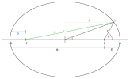

# Ellipse

## Geometry


In the above diagram a point $P$ on the ellipse forms an angle $E$ with the origin and the $x$ axis. Additionally the angle $\theta$ is formed at the ellipse's focus between the point on the ellipse and the axis.

Additionally the distances $a$ and $p$ are the apoapsis and periapsis distances respectively.

The semi major axis has been labeled as $A$, so that the total width of the ellipse is $2A$. Not shown on the diagram is the semi minor axis $B$. However the total height of the ellipse in the diagram is $2B$.

For this text we will take the elliptical eccentricity to be defined as the ratio of the focus and the semi major axis.

``` math
e = \frac{f}{A}
```

### The Apses

Before we get any further, we will look at the apses. From the diagram we can see that

``` math
p = A - f = A - eA = A(1-e)
```

and that
``` math
a  = A + f = A + eA = A(1+e)
```

Additionally

``` math
\begin{align*}
a+p &= A -f + A +f = 2A \\
a-p &= A + f - A + f = 2f
\end{align*}
```

which can give us the eccentricity as defined by the apses
``` math
e=\frac{f}{A}=\frac{2f}{2A}=\frac{a-p}{a+p}
```

### Sum of distances from foci and $P$

One property of an ellipse is that the sum of the distances from any point on the ellipse and the foci is a constant. This fact allows you to draw an ellipse using two pins and a piece of string. We will use this fact and look at two special cases, before looking at the general case and deriving the equation for an ellipse. Before we do we will define what the sum is here.

``` math
S = d + r
```

#### Special Case 1 point on the $x$ axis

When the point is at $(A,0). The distance $d$ is $f+A$ and the distance $r$ is $A-f$ from the diagram above. So our sum becomes

``` math
S = d + r = f+A + A-f = 2A
```
#### Special Case 2 point on the $y$ axis

When the point is on the $y$ axis, it is at the point $(0,B)$. The distance $d$ is $\sqrt{f^2+B^2}$ and the distance $r$ is also $\sqrt{f^2+B^2}$ from the diagram above. So our sum is

``` math
S = 2 \sqrt{f^2+B^2}
```

and if the sum is a constant then this will be equal to the value obtained before.

``` math
S = 2 \sqrt{f^2+B^2} = 2 A
```

and so we now have the relationship between the semi major and minor axes and the focus

``` math
 A^2=f^2+B^2
```

This can also be used to get $B$ in terms of $A$ using the connection to the eccentricity

``` math
\begin{align*}
B^2&=A^2-f^2\\
&=A^2-(eA)^2\\
&=A^2(1-e^2)\\
\Rightarrow  & B = A\sqrt{1-e^2}
\end{align*}
```

#### General case

In general for a point at $(x,y)$ we get
``` math
\begin{align*}
r^2&=(x-f)^2+y^2\\
d^2&=(x+f)^2+y^2
\end{align*}
```

##### Cartesian Form

The sum becomes

``` math
\begin{align*}
S=2A&=\sqrt{(x-f)^2+y^2}+\sqrt{(x+f)^2+y^2}\\
2A-\sqrt{(x-f)^2+y^2} &= \sqrt{(x+f)^2+y^2}
\end{align*}
```
squaring both sides gives
``` math
\begin{align*}
\left( 2A-\sqrt{(x-f)^2+y^2} \right)^2 &= (x+f)^2+y^2\\
4A^2-4A\sqrt{(x-f)^2+y^2}+(x-f)^2+y^2  &= (x+f)^2+y^2\\
4A^2-4A\sqrt{(x-f)^2+y^2}+x^2-2xf+f^2  &= x^2+2xf+f^2\\
4A^2-4A\sqrt{(x-f)^2+y^2} &= 4xf\\
4A^2-4xf &= 4A\sqrt{(x-f)^2+y^2}\\
\frac{4A^2-4xf}{4A} &= \sqrt{(x-f)^2+y^2}\\
\sqrt{(x-f)^2+y^2} &=A-\frac{xf}{A} 
\end{align*}
```
Squaring both sides gives
``` math
\begin{align*}
(x-f)^2+y^2 &=\left(A-\frac{xf}{A}\right)^2 \\
x^2-2xf+f^2+y^2 &=A^2-2\frac{xfA}{A}+\frac{x^2f^2}{A^2} \\
x^2-2xf+f^2+y^2 &=A^2-2xf+e^2x^2 \\
(1-e^2)x^2+y^2 &=A^2-f^2 \\
(1-e^2)x^2+y^2 &=A^2(1-e^2) \\
\frac{(1-e^2)x^2}{A^2(1-e^2)}+\frac{y^2}{A^2(1-e^2)}&=1\\
\frac{x^2}{A^2}+\frac{y^2}{B^2}&=1
\end{align*}
```

##### Polar Form

Firstly from the diagram we note that
``` math
\begin{align*}
x &= f+r \cos \theta\\
y &= r \sin \theta
\end{align*}
```

Then starting from the sum
``` math
\begin{align*}
S = 2A &= r + d\\
2A -r &= d
\end{align*}
```
``` math
\begin{align*}
\left(2A -r\right)^2 &= d^2\\
4A^2 -4Ar +r^2 &= (x+f)^2+y^2\\
&= x^2+2fx+f^2+y^2\\
&= \left(f+r \cos \theta\right)^2+2fx+f^2+r^2\sin^2\theta\\
&= f^2+2fr \cos \theta + r^2 \cos^2\theta+2f\left(f+r \cos \theta\right)+f^2+r^2\sin^2\theta\\
 &= f^2+2fr \cos \theta +2f^2+2fr \cos\theta+f^2+r^2(\sin^2\theta+\cos^2\theta)\\
 &= 4f^2+4fr \cos \theta+r^2\\
A^2 -Ar &= f^2+fr \cos \theta\\
A^2 -f^2 &= \left( A+f \cos \theta\right) r\\
A^2 -e^2A^2 &= \left( A+eA \cos \theta\right) r\\
A^2\left(1-e^2\right)&= A\left( 1+e \cos \theta\right) r\\
A\left(1-e^2\right)&= \left( 1+e \cos \theta\right) r\\
\end{align*}
```
finally leading to
``` math
r = \frac{A\left(1-e^2\right)}{ 1+e \cos \theta}

```

### Relationship between $\theta$ and $E$

The point on the ellipse is at $(x,y)$ where $x$ and $y$ are given by

``` math
\begin{align*}
x &= A \cos E \\
y &= B \sin E
\end{align*}
```
As seen above though these can also be written as
``` math
\begin{align*}
x &= f+r \cos \theta\\
y &= r \sin \theta
\end{align*}
```