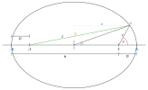

# Ellipse

## Geometry


In the above diagram a point on the ellipse forms an angle $E$ with the origin and the x axis. Additionally the angle $\theta$ is formed at the ellipse's focus between the point on the ellipse and the axis.

Additionally the distances $a$ and $p$ are the apoapsis and periapsis distances respectively. The semi major axis has been labeled as $A$, so that the total width of the ellipse is $2A$. Not shown on the diagram is the semi minor axis $B$. However the total height of the ellipse in the diagram is $2B$.

The point on the ellipse is at $(x,y)$ where $x$ and $y$ are given by

``` math
\begin{*align}
x &= A \cos E \\
y &= B \sin E
\end{*align}
```