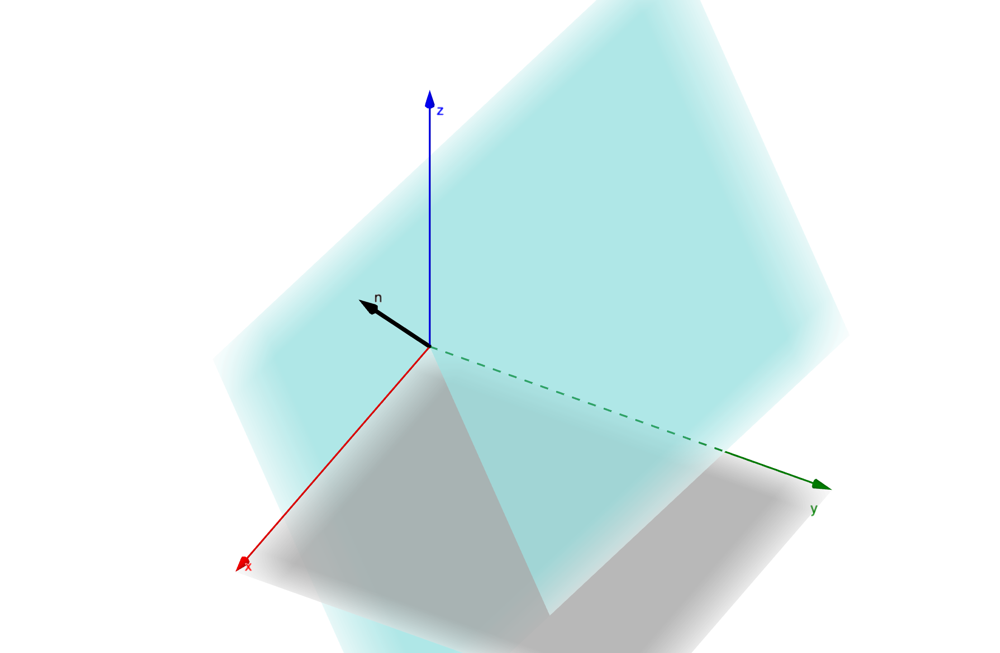

# The Orbital Plane

Here we will develop the [orbital elements](https://en.wikipedia.org/wiki/Orbital_elements) in terms of planes. We should be able to translate a set of orbital elemnts to their coresponding plane and then any postition along an orbit within the orbital plane to it's position relative to the reference plane.

## The Reference Plane

Since we could choose any plane we liked as a reference plane, we'll make some convention choices now. When setting up axes for our reference plane[^1]. We will choose our x axis[^2] to be our "reference direction"


[^1]:Any plane and it's normal forms a reference frame.
[^2]:And correspondingly our i unit vector

## Equations of a Plane

Since the Orbital Plane is a plane like any other we can start with the typical vector equation that forms a plane.

``` math
\mathbf{r} = \mathbf{a} + \lambda \mathbf{b} + \mu \mathbf{c}
```
where $\mathbf{a}$ is a vector that goes from the origin to a point on the plane, $\mathbf{b}$ and $\mathbf{c}$ are non-coliniar vectors within the plane.

We can define a plane normal by taking the cross product of $\mathbf{b}$ and $\mathbf{c}$ as so
``` math
\mathbf{n} = \mathbf{b} \times \mathbf{c}
```
Taking the dot product with this normal

``` math
\begin{align*}
\mathbf{n} \cdot \mathbf{r} &= \mathbf{n} \cdot  \mathbf{a} + \lambda \mathbf{n} \cdot  \mathbf{b} + \mu \mathbf{n} \cdot \mathbf{c} \\
&=\mathbf{n} \cdot  \mathbf{a}
\end{align*}
```
where we have used the fact that $\mathbf{n} \cdot  \mathbf{b} = \mathbf{n} \cdot \mathbf{c} = 0$ because by definition the normal is perpendicular to both $\mathbf{b}$ and $\mathbf{c}$ and so the dot product is zero.

This gives us the other form of the equation for a plane of
``` math
\mathbf{n} \cdot \mathbf{r}=\mathbf{n} \cdot  \mathbf{a}
```
or
``` math
n_x x + n_y y +n_z z=k
```
where $k = \mathbf{n} \cdot  \mathbf{a}$.
In the case where the plane passes through the origin, $\mathbf{a}=\mathbf{0}$, so the dot product is also zero, and so $k$ is zero, giving us the form
``` math
n_x x + n_y y +n_z z=0
```

Since our orbital plane crosses through the origin of the refence plane also, we can fully describe the orbital plane by it's normal vector.

## The Normal of the Plane

Since it is often easier to think about a plane going through based on it's normal vector[^3]. We will start from the normal vector and use it to describe the orbital elements, so that for a given normal we can calculate the orbital elements or if given a set of orbital elements, we can work backwards to a plane normal. Thoughtout this text we will assume the normal vector is a unit vector, if it is not, we can replace it with $\hat{\mathbf{n}}$ given by

``` math
\hat{\mathbf{n}}= \frac{\mathbf{n}}{|\mathbf{n}|}=\frac{\mathbf{n}}{\sqrt{\mathbf{n} \cdot \mathbf{n} }}
```

Thoughout the rest of this text any reference to the orbital plane normal will assume it to be normal and so we will drop the hat notation for ease.



[^3]: As we saw earlier, the equation of a plane through the origin is fully defined by the normal

## The Ascending Node

The Ascending Node is the point at which the path of an orbiting body goes through the reference plane in the same direction as the reference plane's normal. For our calculations, it's just the direction to the orbital node that maters as it helps us establish an axis we can use within our orbital plane. The Ascending Node direction is the shared direction of both the orbital plane and the reference plane.


Using our eqution for a plane based on the normal, we can work out when this crosses the reference plane by noting that a line is formed when they cross, when $z=0$ for the orbital plane.
``` math
\begin{align*}
0&=n_x x + n_y y +n_z 0\\
0&=n_x x + n_y y\\
-n_y y &= n_x x \\
y&=\frac{-n_x}{n_y} x
\end{align*}
```
This gives the equation of the line, but to get the direction of the ascending node, we need to consider the vector form
``` math
\mathbf{r} = \mathbf{a} + \mu \mathbf{b}
```
Where $\mathbf{a}$ is the vector between the origin and any point on the line, and $\mathbf{b}$ is a vector in the direction of the line. $\mathbf{a}$ is zero because the planes pass through the origin so the shared line of intersection between them will also go through the origins. We can introduce a parameter $\mu$ into the equation for the line by initially taking $x=\mu$ so that the $y$ part becomes $y=\frac{-n_x}{n_y} x$, so we get the vector form being

``` math
\begin{pmatrix}
x \\
y\\
z
\end{pmatrix} = \mu \begin{pmatrix}
1 \\
-\frac{n_x}{n_y}\\
0
\end{pmatrix}
```
Our direction to the ascending node is then 
``` math
\begin{pmatrix}
1 \\
-\frac{n_x}{n_y}\\
0
\end{pmatrix}
```
We would like this to be a unit vector so we do that by dividing by the length of the vector, we will call the unit vector in the direction of the ascending node $\hat{\mathbf{u}}$

``` math
\hat{\mathbf{u}} = \frac{1}{\sqrt{1+\frac{n_x^2}{n_y^2}}}\begin{pmatrix}
1 \\
-\frac{n_x}{n_y}\\
0
\end{pmatrix}
```
Firstly we can simplify the root

``` math
\begin{align*}
\sqrt{1+\frac{n_x^2}{n_y^2}} &= \sqrt{\frac{n_y^2}{n_y^2}+\frac{n_x^2}{n_y^2}}\\
 &= \sqrt{\frac{n_x^2+n_y^2}{n_y^2}}\\
 &= \frac{1}{n_y}\sqrt{n_x^2+n_y^2}\\
\end{align*}
```
Putting this back in we get
``` math
\hat{\mathbf{u}} = \frac{n_y}{\sqrt{n_x^2+n_y^2}}\begin{pmatrix}
1 \\
-\frac{n_x}{n_y}\\
0
\end{pmatrix}
```
Feeding the $n_y$ into the vector gives
``` math
\hat{\mathbf{u}} = \frac{1}{\sqrt{n_x^2+n_y^2}}\begin{pmatrix}
n_y \\
-n_x\\
0
\end{pmatrix}
```

## Establishing a Third Vector

We now need a third vector to describe the orbial plane, we already have $\hat{\mathbf{n}}$ and $\hat{\mathbf{u}}$, so we can establish the a third vector by taking their cross product to form a new set of axes. We would like our new set of axes to form a right handed coordinate system, so we should think of $\hat{\mathbf{u}}$ and $\hat{\mathbf{n}}$ as the new coordinate systems $\hat{\imath}$ and $\hat{k}$ respectively, however to avoid confusion we will still with $\hat{\mathbf{u}}$ and $\hat{\mathbf{n}}$. However since for a right handed coordinate system
``` math
\hat{\jmath} = \hat{k} \times \hat{\imath}
```
 we can get our third vector simarly, we will call it $\hat{\mathbf{v}}$.

``` math
\hat{\mathbf{v}}= \hat{\mathbf{n}} \times \hat{\mathbf{u}}
```

For now we won't worry about having a unit vector, just caculate the direction first, so the cross product can be set up as
``` math
\hat{\mathbf{v}}= \hat{\mathbf{n}} \times \hat{\mathbf{u}}
```
