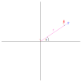

# Orbits

## Plane Polar Coordinates



### Unit vectors

The unit vectors of plain polar coordinates can be determined from the standard unit vectors from the geometry above as

```math
\begin{align*}
\hat{\bm{r}} &= \bm{\hat{\textnormal{\bf\i}}} \cos( \theta ) + \bm{\hat{\textnormal{\bf\j}}} \sin( \theta ) \\
\hat{\bm{\theta}}  &= - \bm{\hat{\textnormal{\bf\i}}} \sin( \theta ) + \bm{\hat{\textnormal{\bf\j}}} \cos( \theta )
\end{align*}
```

Where $r$ is the distance from the origin to the position or alternatively the length of the position vector, and $\theta$ is the angle between $\bm{\hat{\textnormal{\bf\i}}}$ and $\bm{r}$.
Since the unit vectors $\hat{\bm{r}}$ and $\hat{\bm{\theta}}$ depend on $\theta$ which changes with time, the unit vectors also change with time. We will begin by looking at the derivative of $\hat{\bm{r}}$ with respect to time.

```math
\begin{align*}
\frac{d {\hat{\bm{r}}}}{d t} &= \frac{ d \theta}{d t}\frac{d}{d \theta} \hat{\bm{r}} \\
&=  \frac{ d \theta}{d t} \left[ -\bm{\hat{\textnormal{\bf\i}}} \sin( \theta ) + \bm{\hat{\textnormal{\bf\j}}} \cos( \theta ) \right] \\
&= \frac{ d \theta}{d t} \hat{\bm{\theta}}
\end{align*}
```

Where we have used replaced the cartesian unit vectors with their corresponding plane polar ones.

```math
\begin{align*}
\frac{d {\hat{\bm{\theta}}}}{d t}&=\frac{d \theta}{d t} \frac{d}{dt}{\hat{\bm{\theta}}}\\
&=\frac{d \theta}{d t}  \left[ - \bm{\hat{\textnormal{\bf\i}}} \cos( \theta ) - \bm{\hat{\textnormal{\bf\j}}} \sin( \theta ) \right]\\
&=- \frac{d \theta}{d t} \hat{\bm{r}}
\end{align*}
```

Where once again we have used replaced the cartesian unit vectors with their corresponding plane polar ones.

Since $\frac{d {\hat{\bm{r}}}}{d t}$ too depends on $\theta$ so is also time dependent. So we can differentiate again.

```math
\begin{align*}
\frac{d^2 {\hat{\bm{r}}}}{d t^2} &= \frac{d}{dt}\left[ \frac{ d \theta}{d t} \hat{\bm{\theta}} \right]\\
&=\frac{d^2 \theta}{d t^2}\hat{\bm{\theta}}+\frac{d \theta}{d t} \frac{d \hat{\bm{\theta}}}{dt}\\
&=\frac{d^2 \theta}{d t^2}\hat{\bm{\theta}}+\frac{d \theta}{d t} \left[- \frac{d \theta}{d t} \hat{\bm{r}} \right]\\
&=\frac{d^2 \theta}{d t^2}\hat{\bm{\theta}}-\left(\frac{d \theta}{d t} \right)^2 \hat{\bm{r}}
\end{align*}
```

## Velocity and Acceleration in polar coordinates

Now that we have seen how the unit vectors change with respect to time, we can now look at how the position vector changes.

The position vector is

```math
\textbf{r}= r \hat{\textbf{r}}
```

Taking the derivative with respect to time gives us the velocity

```math
\begin{align*}
\frac{d \bm{r}}{d t} &= \frac{d r}{d t} \hat{\bm{r}} + r \frac{d \hat{\bm{r}}}{d t}\\
&=\frac{d r}{d t} \hat{\bm{r}} + r\frac{ d \theta}{d t} \hat{\bm{\theta}}\\
&=\frac{d r}{d t} \hat{\bm{r}} + r \omega \hat{\bm{\theta}}
\end{align*}
```

where we have used $\omega = \frac{ d \theta}{d t}$.

The acceleration can be obtained by taking the derivative with respect to time of the velocity.

```math
\begin{align*}
\frac{ d^2 \bm{r}}{ d t^2} &=\frac{d}{d}\left[\frac{d r}{d t} \hat{\bm{r}} + r \omega \hat{\bm{\theta}}\right]\\
&=\frac{d}{d}\left[\frac{d r}{d t} \hat{\bm{r}}\right] + \frac{d}{dt}\left[r \omega \hat{\bm{\theta}}\right]\\
&= \left[\frac{ d^2 r}{d t^2} \hat{\bm{r}} + \frac{d r}{d t} \frac{d \hat{\bm{r}}}{d t}\right] +\left[\frac{d r}{d t} \omega \hat{\bm{\theta}} +r \frac{d \omega}{d t} \hat{\bm{\theta}}+r \omega \frac{d \hat{\bm{\theta}}}{d t} \right]\\
&=  \frac{ d^2 r}{d t^2} \hat{\bm{r}} + \frac{d r}{d t} \omega \hat{\bm{\theta}} +\frac{d r}{d t} \omega \hat{\bm{\theta}} +r \frac{d \omega}{d t} \hat{\bm{\theta}}-r \omega^2 \hat{\bm{r}} \\
&=\left[  \frac{ d^2 r}{d t^2} -r \omega^2 \right] \hat{\bm{r}} + \left[ 2 \frac{d r}{d t} \omega + r \frac{ d \omega}{d t} \right] \hat{\bm{\theta}}
\end{align*}
```

We have had to use the triple product rule here. (The derivation for this is shown in another page)

## Gravity

The gravitational force between two particles a distance $r$ apart with mass $M$ and $m$ is given by

```math
\bm{F}=-\frac{GMm}{r^2}\hat{\bm{r}}
```

The acceleration of the particle with mass $m$ due to the force of gravity between the two particles is then

```math
\frac{d^2\bm{r}}{dt^2}=\frac{\bm{F}}{m}=-\frac{GM}{r^2}\hat{\bm{r}}
```

We can then equate this to the acceleration in terms of polar coordinates to get

```math
-\frac{GM}{r^2}\hat{\bm{r}} = \left[  \frac{ d^2 r}{d t^2} -r \omega^2 \right] \hat{\bm{r}} + \left[ 2 \frac{d r}{d t} \omega + r \frac{ d \omega}{d t} \right] \hat{\bm{\theta}}
```

which we can split up into two parts, a radial part and an angular part

```math
\begin{align*}
-\frac{GM}{r^2}&= \frac{ d^2 r}{d t^2} -r \omega^2  \\
0 &= 2 \frac{d r}{d t} \omega + r \frac{ d \omega}{d t}
\end{align*}
```

## Angular Momentum

The angular momentum of a particle is given by the cross product of the position vector and the momentum vector.

```math
\begin{align*}
\bm{L}&=\bm{r} \times \bm{p}\\
&=\bm{r} \times \left(m\frac{d\bm{r}}{dt}\right)\\
&=m \bm{r} \times \frac{d\bm{r}}{dt}\\
&=m r\hat{\bm{r}} \times \left(\frac{d r}{d t} \hat{\bm{r}} + r \omega \hat{\bm{\theta}}\right)\\
&=mr\frac{d r}{d t}\hat{\bm{r}} \times \hat{\bm{r}} + mr r \omega \hat{\bm{r}} \times\hat{\bm{\theta}}\\
&=mr^2 \omega \hat{\bm{r}} \times\hat{\bm{\theta}}\\
&=mr^2\omega \hat{\bm{k}}
\end{align*}
```

We can also write this as $\bm{L} = l \hat{\bm{k}}$ were

```math
l=mr^2\omega
```

### Conservation of Angular Momentum

We can show now that angular momentum is conserved under a central force by taking the derivative with respect to time.

```math
\begin{align*}
\frac{dl}{dt}&=m\frac{d}{dt}\left[r^2\omega\right]\\
&=m\left[\frac{dr^2}{dt}\omega + r^2\frac{d\omega}{dt}\right]\\
&=m\left[\frac{dr^2}{dr}\frac{dr}{dt}\omega + r^2\frac{d\omega}{dt}\right]\\
&=m\left[2r\frac{dr}{dt}\omega + r^2\frac{d\omega}{dt}\right]\\
&=mr\left[2\frac{dr}{dt}\omega + r\frac{d\omega}{dt}\right]\\
&=mr \times 0\\
&=0
\end{align*}
```

where we have used angular part of the acceleration being 0. This shows that the angular momentum is conserved. ie it is a constant with respect to time.

## Energy

### Potential energy

Firstly let us consider the potential energy of the particle. The potential energy is the work done in moving the particle from a radius of $\infty$ to $r$.
So the work done is given by

```math
\begin{align*}
U(r)&=\int_{\infty}^{r} \bm{F}(r') \cdot d\bm{r}' \\
&=\int_{\infty}^{r} -\frac{GMm}{r'^2} \hat{\bm{r}} \cdot dr' \hat{\bm{r}}  \\
&=-GMm\int_{\infty}^{r} \frac{dr'}{r'^2} \\
&=-GMm \left[ \frac{-1}{r'} \right]_{\infty}^{r} \\
&=GMm \left[ \frac{1}{\infty} - \frac{1}{r} \right] \\
&=- \frac{GMm}{r}
\end{align*}
```

### Kinetic Energy

The kinetic energy of a particle is given by

```math
T(\dot{r})=\frac{1}{2}m\dot{\bm{r}}\cdot\dot{\bm{r}}
```

using this gives us the kinetic energy as

```math
\begin{align*}
T(\dot{r})&=\frac{1}{2}m\left[ \dot{r}\hat{\bm{r}}+r\omega\hat{\bm{\theta}}\right]\cdot\left[ \dot{r}\hat{\bm{r}}+r\omega\hat{\bm{\theta}}\right] \\
&=\frac{1}{2}m \dot{r}^2 + \frac{1}{2}mr^2 \omega^2
\end{align*}
```

we can also make the substitution using the angular momentum.

```math
\begin{align*}
l&=mr^2\omega  \\
\omega&=\frac{l}{mr^2}
\end{align*}
```

So that

```math
\begin{align*}
T(\dot{r})
&=\frac{1}{2}m \dot{r}^2 + \frac{1}{2}mr^2 \left(\frac{l}{mr^2}\right)^2\\
&=\frac{1}{2}m \dot{r}^2 + \frac{1}{2}mr^2 \left(\frac{l^2}{m^2r^4}\right)\\
&=\frac{1}{2}m \dot{r}^2 +  \frac{l^2}{2mr^2}\\
\end{align*}
```

### Total Energy

Finally the total energy can be found adding both the kinetic and potential energy.

```math
\begin{align*}
E(r,\dot{r}) &= T(\dot{r}) + U(r)\\
&= \frac{1}{2}m \dot{r}^2 +  \frac{l^2}{2mr^2} - \frac{GMm}{r}
\end{align*}
```

sometimes the last two terms of total energy are put together to form a new potential energy term that is dependent only on the radius and the angular momentum.

#### Conservation of Total Energy
