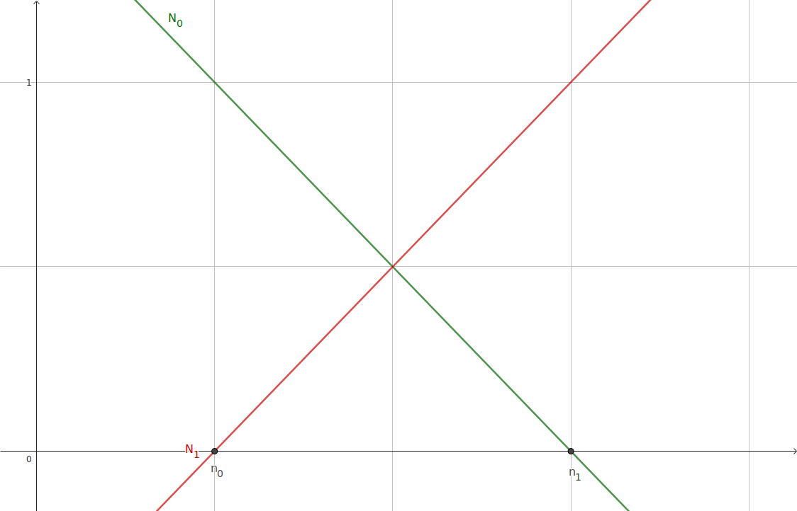
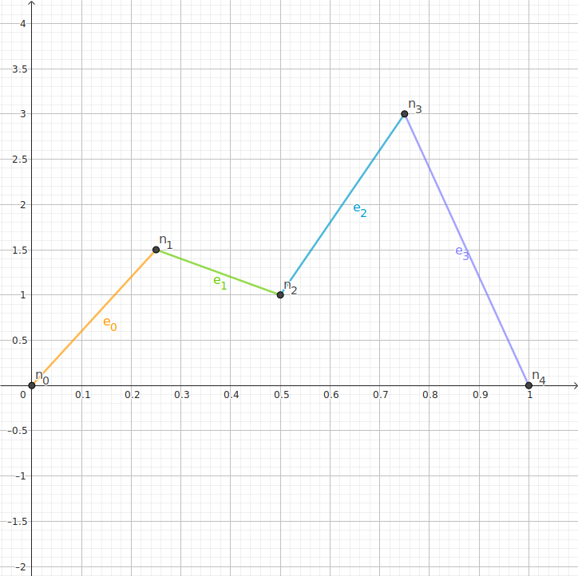

# Finite Element Analysis

## Integration By Parts

Start with product rule

``` math
\begin{align*}
\frac{d uv}{dx} &= u \frac{dv}{dx}+ \frac{du}{dx}v \\
\int_a^b \frac{d uv}{dx} dx &= \int_a^b u \frac{dv}{dx} dx + \int_a^b \frac{du}{dx}v dx \\
\left[ uv \right]_a^b &= \int_a^b u \frac{dv}{dx} dx + \int_a^b \frac{du}{dx}v dx \\
\int_a^b u \frac{dv}{dx} dx &= \left[ uv \right]_a^b - \int_a^b \frac{du}{dx}v dx 
\end{align*}
```

## Element

Consider a linear element with two nodes. Each node at $x_i$ has a shape function $N_i(x)$ that satifies the condition that $N_i(x_j)=\delta_{ij}$ for every node in the element.

For a linear element the shape functions are

``` math
\begin{align*}
N_0(x) &= \frac{x_1-x}{x_1-x_0}\\
N_1(x) &= \frac{x_0-x}{x_0-x_1}
\end{align*}
```



The overall function for the element is

``` math
y(x) = y_0 N_0(x) + y_1 N_1(x)
```

### Second Order ODE

``` math
\begin{align*}
\frac{d^2 y}{dx^2} &= f(y) \\
u(x)\frac{d^2 y}{dx^2} &= u(x)f(y) \\
\int_a^b u(x)\frac{d^2 y}{dx^2} dx &= \int_a^b u(x)f(y) dx
\end{align*}
```
Now integrating by parts on the left hand side
``` math
\begin{align*}
\int_a^b u(x)\frac{d^2 y}{dx^2} dx &= \int_a^b u(x)f(y) dx \\
\left[ u(x) \frac{dy}{dx}\right]_a^b - \int_a^b \frac{d u(x)}{dx}\frac{d y}{dx} dx &= \int_a^b u(x)f(y) dx 
\end{align*}
```
We can choose $u(x)$ to be our shape functions. This will result in one equation per shape function, but if we choose our shape functions so that they follow the condition $u(a)=N_i(a)=0$ and $u(b)=N_i(b)=0$ then we get the first term on the left hand side being zero, so we end up with the simpler form
``` math
\begin{align*}
\left[ u(x) \frac{dy}{dx}\right]_a^b - \int_a^b \frac{d u(x)}{dx}\frac{d y}{dx} dx &= \int_a^b u(x)f(y) dx \\
- \int_a^b \frac{d u(x)}{dx}\frac{d y}{dx} dx &= \int_a^b u(x)f(y) dx
\end{align*}
```

#### Example

Let's start with something we know the solution to then we can compare against a known solution
``` math
\frac{d^2 y}{dx^2} = -k^2 y
```
Which we know to have solutions of the form $y=A\sin(kx)+B\cos(kx)$. Let's pick boundary conditions that $y(0)=0$ and $y(1)=0$. We will also choose to have for equally long linear elements.



##### For element 0

The shape functions are

``` math
\begin{align*}
N_00(x) &= \frac{0.25-x}{0.25} = 1-4x\\
N_01(x) &= \frac{-x}{-0.25} = 4x
\end{align*}
```

With the overall function being
``` math
y(x) = y_0 N_0(x) + y_1 N_1(x)
```
Since the element is on one the boundary conditions, ie $y(0)=0$
``` math
\begin{align*}
y(0) &= y_0 N_0(0) + y_1 N_1(0) \\
0 &= y_0\\
\end{align*}
```
so we are left with
``` math
y(x) = y_1 N_1(x)
```

##### For element 1

The shape functions are

``` math
\begin{align*}
N_10(x) &= \frac{0.5-x}{0.5-0.25} = 2-4x
N_11(x) &= \frac{0.25-x}{0.25-0.5} = 4x - 1
\end{align*}
```

With the overall function being
``` math
y(x) = y_1 N_10(x) + y_2 N_11(x)
```


