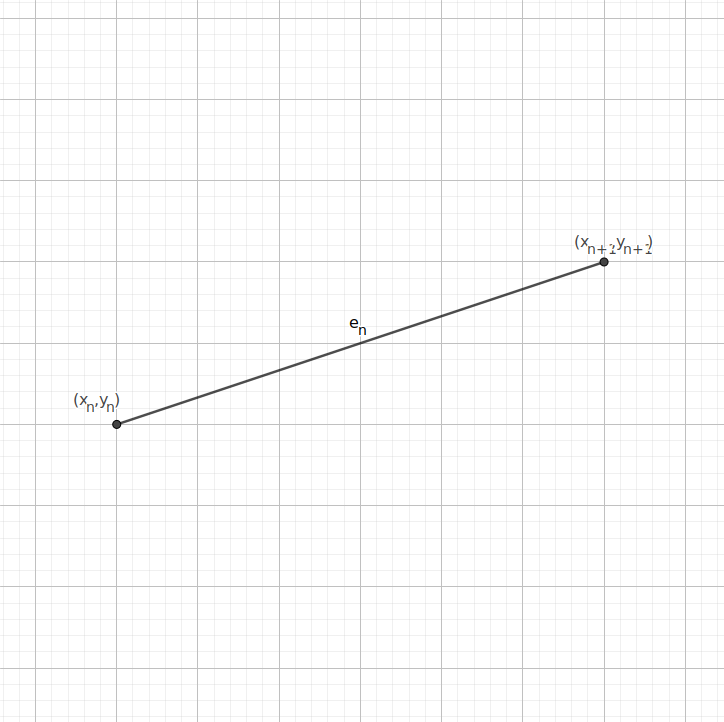

# One Dimensional Linear Element



## Shape function

The general form of the shape function is
``` math
f(x,a,b) = \left\{
\begin{array}{ll}
      \frac{b-x}{b-a} & a\leq x\leq b \\
      0 & otherwise
\end{array} 
\right.
```

This is chosen so that $f(a,a,b)=1$ and f(b,a,b)=0$

Unless the element is on a boundary, the equation for an element is

``` math
f_n(x)=y_nf(x,x_n,x_{n+1})+y_{n+1}f(x,x_{n+1},x_n)
```
