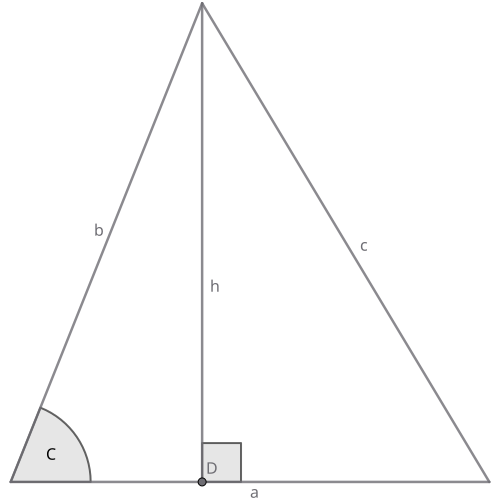

# Källén function

```
The Källén function, also known as triangle function,
is a polynomial function in three variables,
which appears in geometry and particle physics.

In the latter field it is usually denoted by the symbol λ.
It is named after the theoretical physicist Gunnar Källén,
who introduced it as a short-hand in his textbook Elementary Particle Physics.
```
[source](https://en.wikipedia.org/wiki/K%C3%A4ll%C3%A9n_function)

## Definition

``` math
\lambda(a,b,c) = a^2 + b^2 + c^2 - 2ab -2ac -2bc
```

## Relationship with Triangles

Starting with a triangle of with side lengths $a$,$b$ and $c$.



Starting from The Cosine Rule

``` math
c^2 = a^2 + b^2 - 2ab \cos C
```

which can be rearranged for the angle $C$
``` math
\cos C= \frac{a^2 + b^2 -c^2}{2ab}
```

The area of the triangle is given by
``` math
\begin{align*}
A &= \frac{ah}{2}\\
&= \frac{ab \sin C}{2} \\
&= \frac{ab \sqrt{1-\cos^2 C}}{2}\\
\left(\frac{2A}{ab}\right)^2&= 1-\cos^2 C\\
&= 1-\left(\frac{a^2 + b^2 -c^2}{2ab}\right)^2\\
16A^2&= 4a^2b^2-\left(a^2 + b^2 -c^2\right)^2\\
\end{align*}
```
