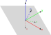

# Arbitary Shperical Polar Rotation of a Vector

## The Problem

Given a vector $\mathbf{v}$ and two angles $0<=\theta<=\pi$ and $0<=\phi<=2\pi$ we wish to rotatate it to $\mathbf{v}'$ so that the angle between $\mathbf{v}$ and $\mathbf{v}'$ is $\theta$. To archive this, a reference plane and direction will be needed, or equivalently a reference plane normal vector and a reference direction.

## Spherical Polar Angle Unit Vector

Before creating a new basis we will firstly look at the use of Spherical Polar Angles to describe any unit vector in three dimensions. Using the standard basis of $\hat{\imath}$, $\hat{\jmath}$ and $\hat{k}$ gives us the form

```math
\hat{\mathbf{u}} = \sin \theta \cos \phi \hat{\imath} + \sin \theta \sin \phi \hat{\jmath} + \cos \theta \hat{k}
```

Or as a column vector[^1]

```math
\hat{\mathbf{u}} = \begin{bmatrix}\sin \theta \cos \phi \\ \sin \theta \sin \phi \\ \cos \theta \end{bmatrix}
```

[^1]: Remember the implied row matrix of basis vectors that premultiplies our column vector

The standard basis vectors forms our reference plane and reference direction. The plane being the plain formed by the vectors $\hat{\imath}$, $\hat{\jmath}$ or equivalently the plane formed with $\hat{k}$ as it's normal vector. The reference direction vector being the vector $\hat{\imath}$. This forms our reference for a general rotation.

## Forming a basis for an arbitrary vector

We wish to rotate based on an arbitrary vector, rather than being forced to use the standard basis vectors. We can do this by forming a new set of basis vectors based on our arbitrary vector. Let's call our arbitrary vector $\mathbf{n}$, which is defined as

```math
\mathbf{n} = n_x \hat{\imath} + n_y \hat{\jmath} +n_z \hat{k}
```



We can firstly set our new basis vectors $\hat{k}'$ to be $\hat{\mathbf{n}}$.

```math
\hat{k}' = \hat{\mathbf{n}} = \frac{\mathbf{n}}{|\mathbf{n}|} = \frac{n_x \hat{\imath} + n_y \hat{\jmath} +n_z \hat{k}}{\sqrt{n_x^2+n_y^2+n_z^2}}
```

This then forms a new plane that is normal to $\hat{k}'$ where this plane intersects with our reference plane forms a new vector $\mathbf{u}$ which is given by the following vector

```math
\mathbf{u} = n_y \hat{\imath} - n_x \hat{\jmath} +0 \hat{k}
```

We can then set our new basis vector $\hat{\imath}'$ as $\hat{\mathbf{u}}$, this vector will be perpendicular to $\hat{\mathbf{n}}$ because it is within the plain that is normal to $\mathbf{n}$.

```math
\hat{\imath}' = \frac{n_y \hat{\imath} - n_x \hat{\jmath}}{\sqrt{n_x^2+n_y^2}}
```

Finally we can obtain a vector perpendicular to both of these by using the cross product of both.

```math
\begin{align*}
\hat{\jmath}' &= \hat{k}' \times \hat{\imath}'\\
&= \frac{n_x \hat{\imath} + n_y \hat{\jmath} +n_z \hat{k}}{\sqrt{n_x^2+n_y^2+n_z^2}} \times \frac{n_y \hat{\imath} - n_x \hat{\jmath}}{\sqrt{n_x^2+n_y^2}}\\
&= \frac{1}{\sqrt{n_x^2+n_y^2}\sqrt{n_x^2+n_y^2+n_z^2}}(n_x \hat{\imath} + n_y \hat{\jmath} +n_z \hat{k})\times (n_y \hat{\imath} - n_x \hat{\jmath}) \\
&= \frac{1}{\sqrt{n_x^2+n_y^2}\sqrt{n_x^2+n_y^2+n_z^2}}(n_x \hat{\imath} \times (n_y \hat{\imath} - n_x \hat{\jmath})+ n_y \hat{\jmath}\times (n_y \hat{\imath} - n_x \hat{\jmath}) +n_z \hat{k}\times (n_y \hat{\imath} - n_x \hat{\jmath}))\\
&=\frac{1}{\sqrt{n_x^2+n_y^2}\sqrt{n_x^2+n_y^2+n_z^2}}(n_x \hat{\imath} \times n_y \hat{\imath} - n_x \hat{\imath} \times n_x \hat{\jmath}+ n_y \hat{\jmath}\times n_y \hat{\imath} - n_y \hat{\jmath}\times n_x \hat{\jmath} +n_z \hat{k}\times n_y \hat{\imath} - n_z \hat{k}\times  n_x \hat{\jmath})\\
&=\frac{1}{\sqrt{n_x^2+n_y^2}\sqrt{n_x^2+n_y^2+n_z^2}}( - (n_x^2+n_y^2) \hat{\imath} \times \hat{\jmath} +n_z n_y \hat{k}\times \hat{\imath} - n_z n_x \hat{k}\times \hat{\jmath})\\
&=\frac{1}{\sqrt{n_x^2+n_y^2}\sqrt{n_x^2+n_y^2+n_z^2}}( - (n_x^2+n_y^2) \hat{k} +n_z n_y \hat{\jmath} + n_z n_x \hat{\imath}) \\
&=\frac{n_x n_z \hat{\imath}+n_y n_z \hat{\jmath} -(n_x^2+n_y^2)\hat{k}}{\sqrt{n_x^2+n_y^2}\sqrt{n_x^2+n_y^2+n_z^2}}  \\
\end{align*}
```

We can then treat these as our new basis vectors for our rotation.

Our new vector $\mathbf{n}'$ is then given by

```math
\begin{align*}
\hat{\mathbf{n}'} &= \sin \theta \cos \phi \hat{\imath}' + \sin \theta \sin \phi \hat{\jmath}' + \cos \theta \hat{k}'\\
&= \sin \theta \cos \phi \hat{u} + \sin \theta \sin \phi (\hat{n} \times \hat{u}) + \cos \theta \hat{n}
\end{align*}
```

## All In Terms of Spherical Polar

Since we can form any unit vector from it's Spherical Polar Angles relative to a reference plane normal and a reference direction within the plane, we can also describe our arbitrary vector in terms of it's Spherical Polar Angles. We will use the angles $\alpha$ and $\beta$ to make it clear which are which, so now

```math
\hat{\mathbf{n}} = \sin \alpha \cos \beta \hat{\imath}+\sin\alpha \sin\beta \hat{\jmath} + \cos \alpha \hat{k}
```

then

```math
\mathbf{u} = \sin\alpha \sin\beta \hat{\imath} - \sin \alpha \cos \beta \hat{\jmath}
```

which gives the unit vector as

```math
\begin{align*}
\hat{\mathbf{u}} &= \frac{\sin\alpha \sin\beta \hat{\imath} - \sin \alpha \cos \beta \hat{\jmath}}{\sqrt{\sin^2\alpha \sin^2\beta + \sin^2 \alpha \cos^2 \beta}}\\
&= \frac{\sin\alpha \sin\beta \hat{\imath} - \sin \alpha \cos \beta \hat{\jmath}}{\sqrt{\sin^2\alpha (\sin^2\beta + \cos^2 \beta)}}\\
&= \frac{\sin\alpha \sin\beta \hat{\imath} - \sin \alpha \cos \beta \hat{\jmath}}{\sqrt{\sin^2\alpha}}\\
&= \frac{\sin\alpha \sin\beta \hat{\imath} - \sin \alpha \cos \beta \hat{\jmath}}{\sin\alpha}\\
&= \sin\beta \hat{\imath} - \cos \beta \hat{\jmath}
\end{align*}
```

Then our cross product for $\mathbf{v}$ is

```math
\begin{align*}
\hat{\mathbf{v}} &= \hat{\mathbf{n}} \times \hat{\mathbf{n}}\\
&= (\sin \alpha \cos \beta \hat{\imath}+\sin\alpha \sin\beta \hat{\jmath} + \cos \alpha \hat{k}) \times (\sin\beta \hat{\imath} - \cos \beta \hat{\jmath})\\
&= (\sin \alpha \cos \beta \hat{\imath}\times (\sin\beta \hat{\imath} - \cos \beta \hat{\jmath})+\sin\alpha \sin\beta \hat{\jmath}\times (\sin\beta \hat{\imath} - \cos \beta \hat{\jmath}) + \cos \alpha \hat{k}\times (\sin\beta \hat{\imath} - \cos \beta \hat{\jmath}))\\
&= (\sin \alpha \cos \beta \hat{\imath}\times \sin\beta \hat{\imath} - \sin \alpha \cos \beta \hat{\imath}\times \cos \beta \hat{\jmath}+ \sin\alpha \sin\beta \hat{\jmath}\times\sin\beta \hat{\imath} - \sin\alpha \sin\beta \hat{\jmath}\times\cos \beta \hat{\jmath} +  \cos \alpha \hat{k}\times\sin\beta \hat{\imath} - \cos \alpha \hat{k}\times\cos \beta \hat{\jmath})\\
&= - (\sin \alpha \cos^2 \beta +\sin\alpha \sin^2\beta)\hat{k} +  \cos \alpha \sin\beta \hat{\jmath} + \cos \alpha \cos \beta \hat{\imath}\\
&= \cos \alpha \cos \beta \hat{\imath} +  \cos \alpha \sin\beta \hat{\jmath}  - \sin \alpha \hat{k}
\end{align*}
```

So in summary we have

```math
\begin{align*}
\hat{\mathbf{u}} &= \hat{\imath}' &= \sin\beta \hat{\imath} - \cos \beta \hat{\jmath} \\
\hat{\mathbf{v}} &= \hat{\jmath}' &= \cos \alpha \cos \beta \hat{\imath} +  \cos \alpha \sin\beta \hat{\jmath}  - \sin \alpha \hat{k} \\
\hat{\mathbf{n}} &= \hat{k}'&= \sin \alpha \cos \beta \hat{\imath}+\sin\alpha \sin\beta \hat{\jmath} + \cos \alpha \hat{k}
\end{align*}
```

Or

```math
\begin{bmatrix}
\hat{\imath}' \\
\hat{\jmath}' \\
\hat{k}'
\end{bmatrix} = \begin{bmatrix}
\sin\beta & - \cos \beta & 0 \\
\cos \alpha \cos \beta &  \cos \alpha \sin\beta & - \sin \alpha \\
\sin \alpha \cos \beta & \sin\alpha \sin\beta & \cos \alpha
\end{bmatrix}\begin{bmatrix}
\hat{\imath} \\
\hat{\jmath} \\
\hat{k}
\end{bmatrix}
```
