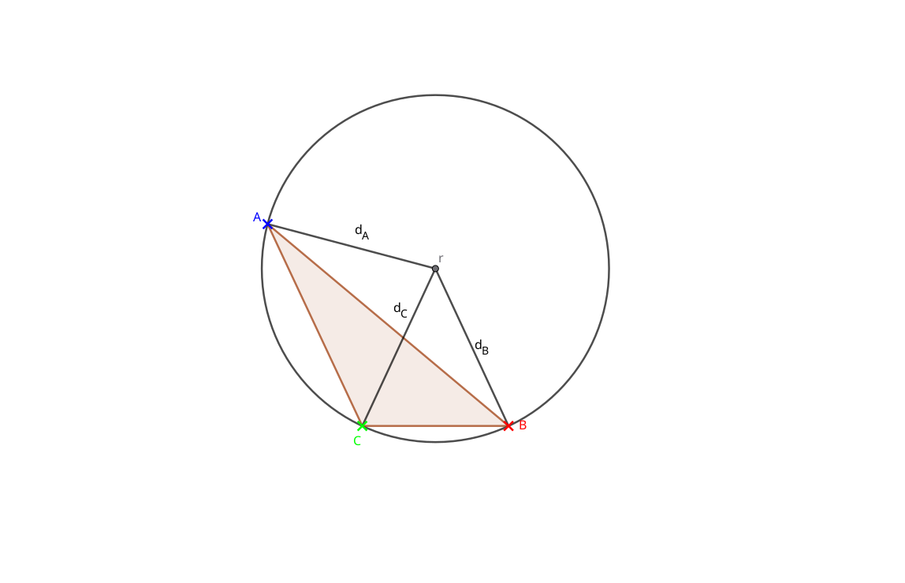

# Circum Circle of a Triangle

A triangle is formed from three points $A=(x_A,y_A)$, $B=(x_B,y_B)$ and $C=(x_C,y_C)$. A circle that passes through each
point can be created, with center $p=(x,y)$ and radius $r$.



From the diagram we can see that $d_A=d_B=d_C=r$.

## Calculation

Firstly we start by determining what $d_A$,$d_B$ and $d_C$ are.

```math
\begin{align*}
d_A &= \sqrt{ (x-x_i)^2 + (y-y_i)^2 } \\
d_B &= \sqrt{ (x-x_j)^2 + (y-y_j)^2 } \\
d_C &= \sqrt{ (x-x_C)^2 + (y-y_C)^2 } \\
\end{align*}
```

### Equating distance pairs

Because these should all be equal we can start by equating pairs of distances $d_i$ with $d_k$

```math
\begin{align*}
d_i &= d_j\\
\sqrt{ (x-x_i)^2 + (y-y_i)^2 }  &= \sqrt{ (x-x_j)^2 + (y-y_j)^2 } \\
(x-x_i)^2 + (y-y_i)^2  &= (x-x_j)^2 + (y-y_j)^2 \\
x^2-2x_i x +x_i^2 + y^2 - 2y_i y + y_i^2 &= x^2-2x_j x +x_j^2 + y^2 - 2y_j y + y_j^2 \\
-2x_i x +x_i^2 - 2y_i y + y_i^2 &= -2x_j x +x_j^2 - 2y_j y + y_j^2 \\
x_i^2 + y_i^2 - x_j^2 - y_j^2&= -2x_j x - 2y_j y +2x_i x+2y_i y\\
(x_i^2 - x_j^2) + (y_i^2 - y_j^2) &= 2(x_i-x_j) x + 2(y_i -y_j) y\\
(x_i - x_j)\frac{x_i + x_j}{2} + (y_i- y_j)\frac{y_i+y_j}{2} &= (x_i-x_j) x + (y_i -y_j) y
\end{align*}
```

Let's label some terms.

- $\frac{x_i + x_j}{2}$ is the x ordinate of the midpoint of the line between $A$ and $B$, we will label this $\hat{x}_{ij}$.
- $\frac{y_i + y_j}{2}$ is the y ordinate of the midpoint of the line between $A$ and $B$, we will label this $\hat{y}_{ij}$
- $x_i - x_j$ we will label $\delta x_{ij}$
- $y_i - y_j$ we will label $\delta y_{ij}$
- Overall the term on the left $\delta x_{ij} \hat{x}_{ij} +\delta y_{ij} \hat{y}_{ij}$ we will label as $K_{ij}$

This gives the overall form of the above as

```math
K_{ij} = \delta x_{ij} x + \delta y_{ij} y
```

### Forming A Matrix

Since we can choose any pair so long as they are different we can look at the pair $i=A,j=B$ and $i=B,j=C$

```math
\begin{align*}
K_{AB} &= \delta x_{AB} x + \delta y_{AB} y\\
K_{BC} &= \delta x_{BC} x + \delta y_{BC} y
\end{align*}
```

Or in matrix form

```math
\begin{pmatrix}
K_{AB} \\
K_{BC}
\end{pmatrix} = \begin{bmatrix}
\delta x_{AB} & \delta y_{AB} \\
\delta x_{BC} & \delta y_{BC} \\
\end{bmatrix}\begin{pmatrix}
x \\
y
\end{pmatrix}
```

Which has a known solution of

```math
\begin{pmatrix}
x \\
y
\end{pmatrix}=\frac{1}{\delta x_{AB}\delta y_{BC} -\delta x_{BC}\delta y_{AB}}\begin{bmatrix}
\delta y_{BC} & -\delta y_{AB} \\
-\delta x_{BC} & \delta x_{AB} \\
\end{bmatrix}\begin{pmatrix}
K_{AB} \\
K_{BC}
\end{pmatrix}
```

### The Determinant as a Cross Product

It's worth noting that the denominator in the solution above has a geometric meaning. Recall the 2D cross product
of two vectors $(a,b)$ and $(c,d)$ is defined as

```math
(a,b) \times (c,d) = ad - bc
```

If we treat each row of our matrix as a vector,

```math
\begin{align*}
\vec{\delta}_{AB} &= (\delta x_{AB}, \delta y_{AB}) \\
\vec{\delta}_{BC} &= (\delta x_{BC}, \delta y_{BC})
\end{align*}
```

then the denominator $\delta x_{AB}\delta y_{BC} - \delta y_{AB}\delta x_{BC}$ is exactly $\vec{\delta}_{AB} \times \vec{\delta}_{BC}$.

Since $\vec{\delta}_{AB}$ and $\vec{\delta}_{BC}$ are the direction vectors of sides $AB$ and $BC$ of the triangle, this gives a
geometric reason for when the system fails to solve: the cross product of two vectors is zero exactly when they are
parallel. If $A$, $B$ and $C$ are collinear, sides $AB$ and $BC$ point along the same line, so $\vec{\delta}_{AB}$ and
$\vec{\delta}_{BC}$ are parallel, the cross product vanishes, and the matrix is singular — matching the earlier observation
that collinear points have no circumcircle.

The magnitude of this cross product also has a second meaning: it equals twice the signed area of the triangle formed
by $A$, $B$ and $C$. This is why quantities of the form "twice the area" often appear alongside circumcenter
calculations — they are, geometrically, the same cross product showing up again.

### $K_{ij}$ as a Dot Product

The term $K_{ij}$ also has a geometric meaning. If we treat the midpoint as a vector $\hat{p}_{ij} = (\hat{x}_{ij}, \hat{y}_{ij})$
and recall the side vector $\vec{\delta}_{ij} = (\delta x_{ij}, \delta y_{ij})$, then

```math
K_{ij} = \delta x_{ij}\, \hat{x}_{ij} + \delta y_{ij}\, \hat{y}_{ij} = \vec{\delta}_{ij} \cdot \hat{p}_{ij}
```

So $K_{ij}$ is exactly the dot product of the side vector with the midpoint vector.

This also explains why the equation $K_{ij} = \delta x_{ij}\, x + \delta y_{ij}\, y$ describes the perpendicular
bisector. A dot product $\vec{a} \cdot \vec{b}$ measures the projection of one vector onto another, so this equation
says: _the point $(x,y)$ has the same projection onto $\vec{\delta}_{ij}$ as the midpoint $\hat{p}_{ij}$ does._ The set of
all points sharing that projection is precisely the line through the midpoint, perpendicular to $\vec{\delta}_{ij}$ — which
is the perpendicular bisector of side $ij$, exactly as expected.

### The Matrix Equation as an Intersection of Two Lines

Putting the previous two sections together, the matrix equation can be read as _finding where two lines cross_.

A line can be described by a **normal vector** $\vec{n}$ (a vector perpendicular to the line) together with a
constant $k$, as the set of all points satisfying

```math
\vec{n} \cdot (x,y) = k
```

This is exactly the shape of each row of our matrix equation. Row one says $\vec{\delta}_{AB} \cdot (x,y) = K_{AB}$,
so it describes a line with normal $\vec{\delta}_{AB}$ passing through every point whose projection onto
$\vec{\delta}_{AB}$ equals $K_{AB}$ — which, as shown above, is the perpendicular bisector of side $AB$. Row two
describes the perpendicular bisector of side $BC$ in the same way, with normal $\vec{\delta}_{BC}$.

So the matrix equation

```math
\begin{pmatrix}
K_{AB} \\
K_{BC}
\end{pmatrix} = \begin{bmatrix}
\delta x_{AB} & \delta y_{AB} \\
\delta x_{BC} & \delta y_{BC} \\
\end{bmatrix}\begin{pmatrix}
x \\
y
\end{pmatrix}
```

is really two lines, each parameterised by its normal vector and a known constant, stacked into one system. Solving
for $(x,y)$ finds the single point lying on _both_ lines at once — the intersection of the two perpendicular bisectors.

This is also why the earlier point about the cross product matters. Two lines defined by normals $\vec{\delta}_{AB}$
and $\vec{\delta}_{BC}$ fail to have a unique intersection exactly when those normals are parallel — since parallel
normals mean the two lines themselves are parallel (or identical) and either never meet or meet everywhere. That
parallel condition is precisely $\vec{\delta}_{AB} \times \vec{\delta}_{BC} = 0$, the same collinearity case identified
above.

Geometrically, then, the whole calculation is: describe each bisector by the direction it is perpendicular to (its
normal) and how far out it sits (via $K_{ij}$), then solve the pair of linear equations to land on the one point
common to both — the circumcenter.
