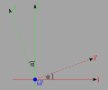

# Euler Angles

Using what we found with transformations [here](./TransformationOfVectorsAndCoordinates.md), we will calculate the transformation for a set of Euler Angles.

## Rotation 1

The first rotation is a rotation about the $\hat{k}$ axis by an angle of $\alpha$.

### Basis Vector Transformation for Rotation 1



The transformation of the basis vectors is

```math
\begin{pmatrix} \hat{\imath}' \\ \hat{\jmath}' \\ \hat{k}' \end{pmatrix} =
\begin{bmatrix}
\cos \alpha & \sin \alpha & 0 \\
-\sin \alpha & \cos \alpha & 0 \\
0 &  & 1 \\
\end{bmatrix}
\begin{pmatrix} \hat{\imath} \\ \hat{\jmath} \\ \hat{k} \end{pmatrix}
```

### Coordinate Transformation for Rotation 1

As we have seen [here](./TransformationOfVectorsAndCoordinates.md), if we know the basis vector transformation then the coordinate transform is

```math
\begin{pmatrix} x \\ y \\ z \end{pmatrix} =
\begin{bmatrix}
\cos \alpha & -\sin \alpha & 0 \\
\sin \alpha & \cos \alpha & 0 \\
0 &  & 1 \\
\end{bmatrix}
\begin{pmatrix} x' \\ y' \\ z' \end{pmatrix}
```
