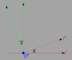
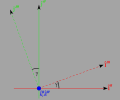

# Euler Angles

Using what we found with transformations [here](./TransformationOfVectorsAndCoordinates.md), we will calculate the transformation for a set of Euler Angles.

## Rotation 1

The first rotation is a rotation about the $\hat{k}$ axis by an angle of $\alpha$.


### Basis Vector Transformation for Rotation 1

The transformation of the basis vectors is

```math
\begin{pmatrix} \hat{\imath}' \\ \hat{\jmath}' \\ \hat{k}' \end{pmatrix} =
\begin{bmatrix}
\cos \alpha & \sin \alpha & 0 \\
-\sin \alpha & \cos \alpha & 0 \\
0 &  & 1 \\
\end{bmatrix}
\begin{pmatrix} \hat{\imath} \\ \hat{\jmath} \\ \hat{k} \end{pmatrix} \tag{1.1}
```

### Coordinate Transformation for Rotation 1

As we have seen [here](./TransformationOfVectorsAndCoordinates.md), if we know the basis vector transformation then the coordinate transform is

```math
\begin{pmatrix} x \\ y \\ z \end{pmatrix} =
\begin{bmatrix}
\cos \alpha & -\sin \alpha & 0 \\
\sin \alpha & \cos \alpha & 0 \\
0 &  & 1 \\
\end{bmatrix}
\begin{pmatrix} x' \\ y' \\ z' \end{pmatrix} \tag{1.2}
```

## Rotation 2

The second rotation is a rotation about the $\hat{\imath}'$ axis with angle being $\beta$.



### Basis Vector Transformation for Rotation 2

The transformation of the basis vectors is

```math
\begin{pmatrix} \hat{\imath}'' \\ \hat{\jmath}'' \\ \hat{k}'' \end{pmatrix} =
\begin{bmatrix}
1 & 0 & 0 \\
0 &\cos \beta & \sin \beta \\
0 &-\sin \beta & \cos \beta \\
\end{bmatrix}
\begin{pmatrix} \hat{\imath}' \\ \hat{\jmath}' \\ \hat{k}' \end{pmatrix} \tag{2.1}
```

### Coordinate Transformation for Rotation 2

```math
\begin{pmatrix} x' \\ y' \\ z' \end{pmatrix} =
\begin{bmatrix}1 &  & 0 \\
0&\cos \beta & -\sin \beta \\
0&\sin \beta & \cos \beta \\
\end{bmatrix}
\begin{pmatrix} x'' \\ y'' \\ z'' \end{pmatrix} \tag{2.2}
```

## Rotation 3

The third rotation is about the $\hat{k}''$ axis by angle $\gamma$.



### Basis Vector Transformation for Rotation 3

The transformation of the basis vectors is

```math
\begin{pmatrix} \hat{\imath}''' \\ \hat{\jmath}''' \\ \hat{k}''' \end{pmatrix} =
\begin{bmatrix}
\cos \gamma & \sin \gamma & 0 \\
-\sin \gamma & \cos \gamma & 0 \\
0 &  & 1 \\
\end{bmatrix}
\begin{pmatrix} \hat{\imath}'' \\ \hat{\jmath}'' \\ \hat{k}'' \end{pmatrix} \tag{3.1}
```

### Coordinate Transformation for Rotation 3

```math
\begin{pmatrix} x'' \\ y'' \\ z'' \end{pmatrix} =
\begin{bmatrix}
\cos \gamma & -\sin \gamma & 0 \\
\sin \gamma &  \cos \gamma & 0 \\
0 &  & 1 \\
\end{bmatrix}
\begin{pmatrix} x''' \\ y''' \\ z''' \end{pmatrix} \tag{3.2}
```

## Total Rotation

The earlier matrices can be combined to give

### Total Basis Vector Transformation

The transformation of the basis vectors is

```math
\begin{align*} \tag{4.1}
\begin{pmatrix} \hat{\imath}''' \\ \hat{\jmath}''' \\ \hat{k}''' \end{pmatrix} &=
\begin{bmatrix}
\cos \gamma & \sin \gamma & 0 \\
-\sin \gamma & \cos \gamma & 0 \\
0 &  & 1 \\
\end{bmatrix}
\begin{pmatrix} \hat{\imath}'' \\ \hat{\jmath}'' \\ \hat{k}'' \end{pmatrix}\\
&=
\begin{bmatrix}
\cos \gamma & \sin \gamma & 0 \\
-\sin \gamma & \cos \gamma & 0 \\
0 &  & 1 \\
\end{bmatrix}
\begin{bmatrix}
1 & 0 & 0 \\
0 &\cos \beta & \sin \beta \\
0 &-\sin \beta & \cos \beta \\
\end{bmatrix}
\begin{pmatrix} \hat{\imath}' \\ \hat{\jmath}' \\ \hat{k}' \end{pmatrix} \\
&= \begin{bmatrix}
\cos \gamma & \sin \gamma & 0 \\
-\sin \gamma & \cos \gamma & 0 \\
0 &  & 1 \\
\end{bmatrix}
\begin{bmatrix}
1 & 0 & 0 \\
0 &\cos \beta & \sin \beta \\
0 &-\sin \beta & \cos \beta \\
\end{bmatrix}\begin{bmatrix}
\cos \alpha & \sin \alpha & 0 \\
-\sin \alpha & \cos \alpha & 0 \\
0 &  & 1 \\
\end{bmatrix}
\begin{pmatrix} \hat{\imath} \\ \hat{\jmath} \\ \hat{k} \end{pmatrix}
\end{align*}
```

### Total Coordinate Transformation

```math
\begin{align*} \tag{4.2}
\begin{pmatrix} x \\ y \\ z \end{pmatrix} &=
\begin{bmatrix}
\cos \alpha & -\sin \alpha & 0 \\
\sin \alpha & \cos \alpha & 0 \\
0 &  & 1 \\
\end{bmatrix}
\begin{pmatrix} x' \\ y' \\ z' \end{pmatrix} \\
&=\begin{bmatrix}
\cos \alpha & -\sin \alpha & 0 \\
\sin \alpha & \cos \alpha & 0 \\
0 &  & 1 \\
\end{bmatrix}
\begin{bmatrix}1 &  & 0 \\
0&\cos \beta & -\sin \beta \\
0&\sin \beta & \cos \beta \\
\end{bmatrix}
\begin{pmatrix} x'' \\ y'' \\ z'' \end{pmatrix} \\
&=\begin{bmatrix}
\cos \alpha & -\sin \alpha & 0 \\
\sin \alpha & \cos \alpha & 0 \\
0 &  & 1 \\
\end{bmatrix}
\begin{bmatrix}1 &  & 0 \\
0&\cos \beta & -\sin \beta \\
0&\sin \beta & \cos \beta \\
\end{bmatrix}
\begin{bmatrix}
\cos \gamma & -\sin \gamma & 0 \\
\sin \gamma &  \cos \gamma & 0 \\
0 &  & 1 \\
\end{bmatrix}
\begin{pmatrix} x''' \\ y''' \\ z''' \end{pmatrix}
\end{align*}
```
