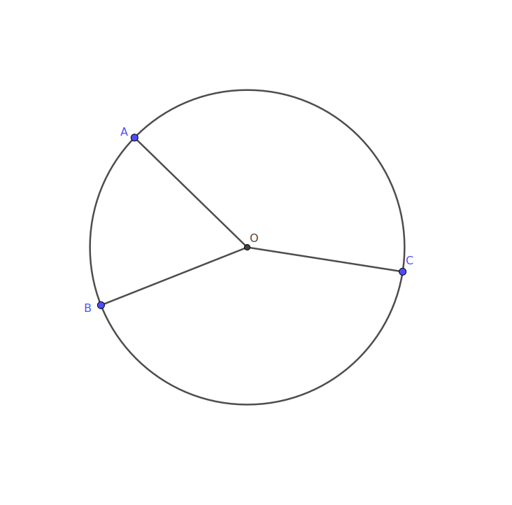

# Circumcircle of a triangle

The circumcircle of a triangle is a circle of minimum radius that fully contains the triangle.

Since you can construct a circle that goes through any three points, the circumcircle will actually touch the three corners of the triangle.

This means constructing the circumcircle is the same as constructing a circle through three points.

## Finding the centre

### Method 1

This method uses the fact that the distance to the centre of the circumcircle to each corner is the same for every corner.



The triangle corners are labelled $A$, $B$ and $C$ and the centre of the circumcircle is labelled $O$

The distance to any point $P$ is given by

``` math
\left| O - P \right|^2 = R^2 =\left| O \right|^2 + \left| P^2 \right| - 2 O \cdot P
```

Where R is the radius of the circumcircle.

We can subtract any two distances from each other say between point $P$ and point $Q$, and since the distances are the same for every corner of the triangle we obtain the following

``` math
\begin{align*}
\left| O - P \right|^2 - \left| O - Q \right|^2 &= \left| O \right|^2 + \left| P^2 \right| - 2 O \cdot P - \left| O \right|^2 - \left| Q^2 \right| + 2 O \cdot Q \\
R^2 - R^2 &=  \left| P^2 \right| - \left| Q^2 \right|- 2 O \cdot P  + 2 O \cdot Q \\
0 &= \left| P^2 \right| - \left| Q^2 \right| - 2 \left( O \cdot P  - O \cdot Q \right) \\
2 \left( O \cdot P  - O \cdot Q \right) &= \left| P^2 \right| - \left| Q^2 \right|  \\
2 O \cdot\left( P  -  Q \right) &= \left| P^2 \right| - \left| Q^2 \right| \\
O \cdot\left( P  -  Q \right) &= \frac{\left| P^2 \right| - \left| Q^2 \right|}{2}
\end{align*}
```

We can write this in terms of coordinates as

``` math
\left( P_x - Q_x \right) O_x  + \left( P_y - Q_y \right) O_y  = \frac{ P_x^2 + P_y^2 - Q_x^2 - Q_y^2 }{2}
```

If we pick two combinations of points, we can get two equations which we can convert into a standard matrix equation.

``` math
\begin{align*}
\left( A_x - B_x \right) O_x  + \left( A_y - B_y \right) O_y  &= \frac{ A_x^2 + A_y^2 - B_x^2 - B_y^2 }{2}\\
\left( A_x - C_x \right) O_x  + \left( A_y - C_y \right) O_y  &= \frac{ A_x^2 + A_y^2 - C_x^2 - C_y^2 }{2}
\end{align*}
```
