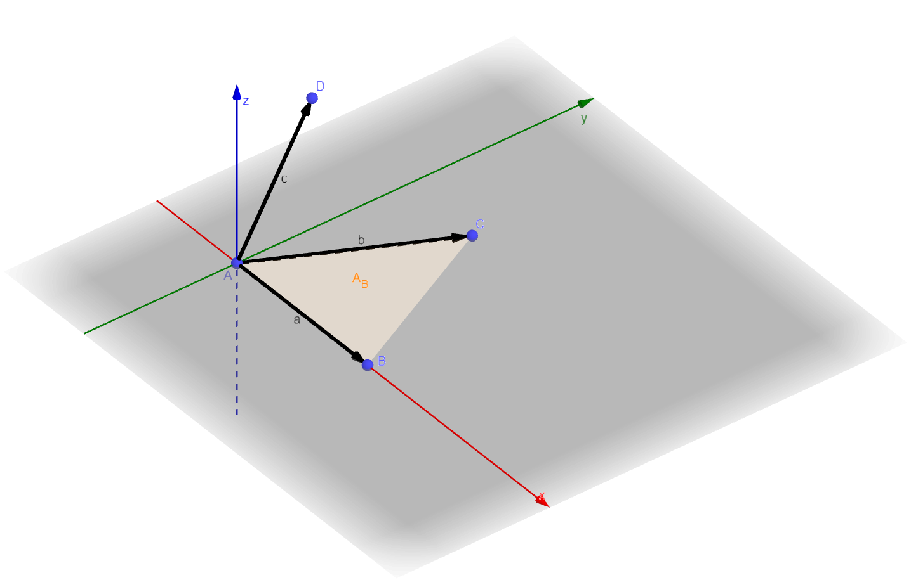
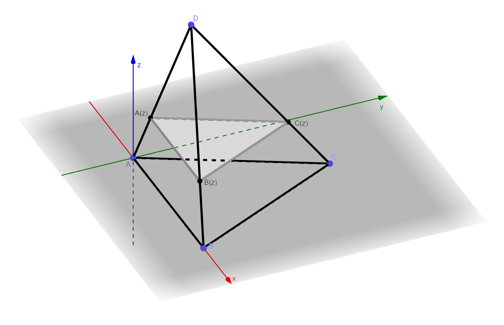
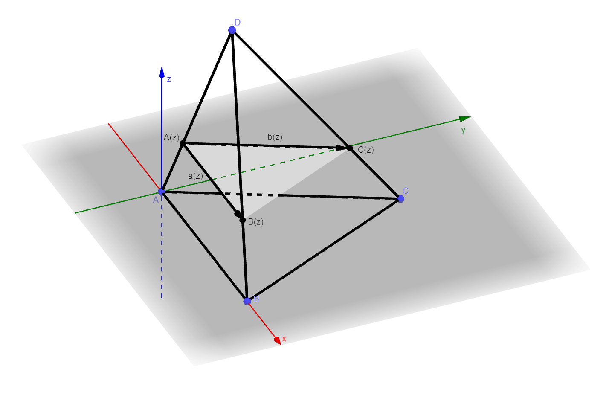

# Tetrahedron

A Tetrahedron is a polyhedron with four vertices, four edges and 6 edges.

## Construction

A Tetrahedron with 4 vertices, A, B, C and D, will have

- Edges

  | Edge | Vertices |
  | :--: | :------: |
  |  1   |  (A,B)   |
  |  2   |  (A,C)   |
  |  3   |  (A,D)   |
  |  4   |  (B,C)   |
  |  5   |  (B,D)   |
  |  6   |  (C,D)   |

- Faces

  | Face | Edges | Vertices |
  | :--: | :---: | :------: |
  |  1   | 1,2,4 | {A,B,C}  |
  |  2   | 1,3,5 | {A,B,D}  |
  |  3   | 2,3,6 | {A,C,D}  |
  |  4   | 4,5,6 | {B,C,D}  |

## Volume

The volume of a tetrahedron is a sixth the volume of the parallelepiped that encloses it. The volume is then given by

```math
\text{volume} =\frac{ \overrightarrow{AB} \cdot (\overrightarrow{AC} \times \overrightarrow{AD} )}{6}
```

### Proof of volume equation

Let's start with a generic tetrahedron as above. We can choose a coordinate system so that the following conditions are met.

- point A is at the origin
- point B lies on the x axis
- point C lies in the xy plane
- point D is above the xy plane

This should be possible by doing the correct translations, rotations and reflections, all of which leave the volume unchanged.



#### Slices in height

The volume of any shape can be considered to be the integral of the area of a slice as a function of height and the height.

```math
\text{Volume}=\int \text{Area}(z) dz
```

If we can find the equation for the area of a slice of the tetrahedron as a function of $z$ then we can calculate the volume.

We will start by working out points along the edges (A,D),(B,D) and (C,D).

Starting with the equation for a point along a segment from point $P$ to point $Q$

```math
r=(1-\alpha)P+\alpha Q
```

For all the edges we care about we get the following

```math
\begin{align*}
A(\alpha)&=(1-\alpha)A+\alpha D \\
B(\beta)&=(1-\beta)B+\beta D \\
C(\gamma)&=(1-\gamma)C+\gamma D
\end{align*}
```

When taking a slice at a given height value, lets say z, then

```math
\begin{align*}
z &= \\
&=(1-\alpha)A_z+\alpha D_z \\
&=(1-\beta)B_z+\beta D_z \\
&=(1-\gamma)C_z+\gamma D_z
\end{align*}
```

Noting that $A_z=B_z=C_z=0$ we get

```math
\begin{align*}
z &= \\
&=\alpha D_z \\
&=\beta D_z \\
&=\gamma D_z
\end{align*}
```

which means that $\alpha = \beta = \gamma = \frac{z}{D_z}$

Giving us

```math
\begin{align*}
A(z)&=\left(1-\frac{z}{h}\right)A+\frac{z}{h} D \\
B(z)&=\left(1-\frac{z}{h}\right)B+\frac{z}{h} D \\
C(z)&=\left(1-\frac{z}{h}\right)C+\frac{z}{h} D
\end{align*}
```

> We have used $h=D_z$ above

So now for any slice through z, we can determine the positions of the vertices that form the triangle within that slice.



#### Slice vectors

Since we have the positions at a given height, we can work out the vectors that form the base and side of the triangle in that slice.

```math
\begin{align*}
\mathbf{a}(z)&=B(z)-A(z)\\
&= \left(1-\frac{z}{h}\right)B+\frac{z}{h} D - \left(\left(1-\frac{z}{h}\right)A+\frac{z}{h}D\right)\\
&= \left(1-\frac{z}{h}\right)(B-A) \\
&=\left(1-\frac{z}{h}\right)\mathbf{a}
\end{align*}
```

```math
\begin{align*}
\mathbf{b}(z)&=C(z)-A(z)\\
&=\left(1-\frac{z}{h}\right)C+\frac{z}{h} D - \left(\left(1-\frac{z}{h}\right)A+\frac{z}{h}D\right)\\
&= \left(1-\frac{z}{h}\right)(C-A)\\
&=\left(1-\frac{z}{h}\right)\mathbf{b}
\end{align*}
```



The area is then given by

```math
\begin{align*}
\text{Area}(z)&=\frac{1}{2} \mathbf{a}(z) \times \mathbf{b}(z)\\
&=\frac{1}{2} \left(\left(1-\frac{z}{h}\right)\mathbf{a} \times \left(1-\frac{z}{h}\right)\mathbf{b}\right) \\
&=\frac{1}{2} \mathbf{a}(z) \times \mathbf{b}(z)\\
&= \left(1-\frac{z}{h}\right)^2\left[\frac{1}{2} \mathbf{a} \times \mathbf{b}\right] \\
&= \left(1-\frac{z}{h}\right)^2 \text{base}
\end{align*}
```

So now we've connected the area of a slice based on the area of the base.

So finally we can do our integral

```math
\begin{align*}
\text{Volume} &=\int_0^h \text{Area}(z) dz\\
 &=\int_0^h \left(1-\frac{z}{h}\right)^2 \text{base } dz\\
 &= \text{base} \int_0^h \left(1-\frac{z}{h}\right)^2 dz\\
\end{align*}
```

Now let $u=1-\frac{z}{h}$

```math
\begin{align*}
\frac{du}{dz} &= - \frac{1}{h} \\
du &= - \frac{1}{h} dz \\
-h du &= dz
\end{align*}
```

Then the limits are $u(0)=1-\frac{0}{h}=1$ and $u(h)=1-\frac{h}{h}=1-1=0$

```math
\begin{align*}
\text{Volume} &= \text{base} \int_0^h \left(1-\frac{z}{h}\right)^2 dz\\
&= \text{base} \int_1^0 u^2 (-h) du \\
&= - \text{base } h \int_1^0 u^2 du \\
&= \text{base } h \int_0^1 u^2 du \\
&= \text{base } h \left[ \frac{u^3}{3} \right]_0^1\\
&= \text{base } h \left[ \frac{1^3}{3} - \frac{0^3}{3}\right]\\
&= \frac{1}{3}\text{base } h
\end{align*}
```

So the volume of the tetrahedron is a third it's base area times it height.

#### Volume in terms of edge vectors

Using the edge vectors we can work out the area of the base. Which is $\frac{1}{2} \left|\mathbf{a} \times \mathbf{b}\right|$

The height depends on taking the projection of the third vector $\mathbf{c}$ onto the normal of the base. The normal is given by $\mathbf{n}=\mathbf{a} \times \mathbf{b}$

So leads to the height being

```math
h=\mathbf{c} \cdot \hat{\mathbf{n}} = \frac{\mathbf{c} \cdot \mathbf{a} \times \mathbf{b}}{\left| \mathbf{a} \times \mathbf{b} \right|}
```

Putting these back into our formula for volume

```math
\begin{align*}
\text{Volume} &= \frac{1}{3}\text{base } h \\
&= \frac{1}{3}\frac{1}{2} \left|\mathbf{a} \times \mathbf{b}\right| \frac{\mathbf{c} \cdot \mathbf{a} \times \mathbf{b}}{\left| \mathbf{a} \times \mathbf{b} \right|}\\
&=\frac{1}{6}\left(\mathbf{c} \cdot \mathbf{a} \times \mathbf{b}\right)
\end{align*}
```
