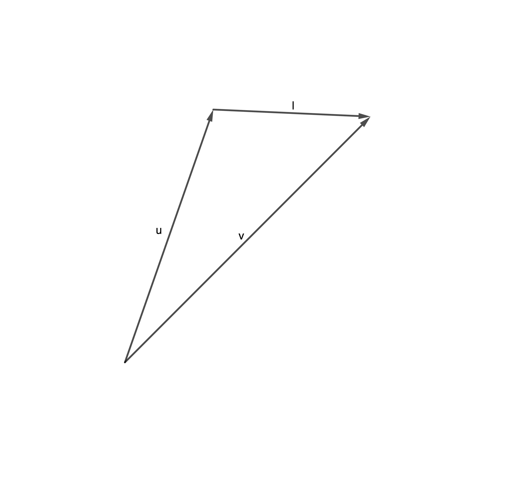

# Length Between Two Vectors

If we have two vectors u and v then the distance between them is given by the length of a vector starting at u and ending at v. We will call this vector l
{width:50%}
``` math
l = v - u
```
