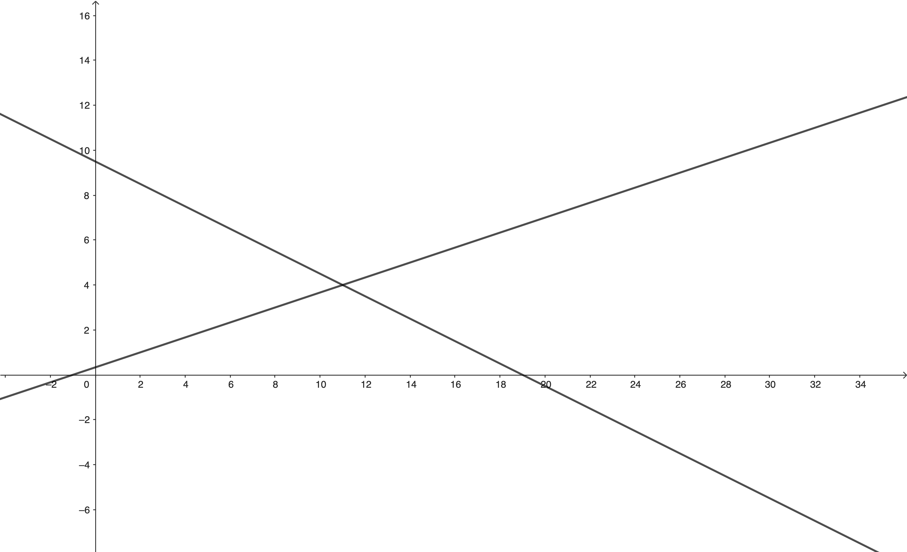

# Linear Algebra

## Simultaneous Equations

Simultaneous equations occur whenever we want to work out where lines, planes or hyperplanes meet. For example in 2 dimensions it would be trying to work out the coordinates that two lines meet.


``` math
\begin{align*}
x+2y&=19 \\
-x+3y&=1
\end{align*}
```

You can solve these by hand by typical algebra methods, but here we're interested in vectors and matrices.

## Matrix Multiplied by a vector

We define that when we multiply a matrix $\mathbf{M}$ by a vector $a$ (where the matrix has as many rows as the vector has columns) we get a vector $b$ who's elements follow the following equation.

``` math
b_i = \sum_{j=0}^n \mathbf{M}_{ij} a_j
```

ie, the ith element of $b$ is the ith row of $M$ multiplied (as in vector dot product) with the vector $a$, ie you might remember it as rows multiplied by the column.

We can also think about matrix times a vector another way, if I rewrite the equation to be more like...

``` math
\begin{pmatrix} \vdots \\ b \\ \vdots \end{pmatrix} = \sum_{j=0}^n \begin{pmatrix} \vdots \\ \mathbf{M}_j \\ \vdots \end{pmatrix} a_j
```

Where

``` math
\begin{pmatrix} \vdots \\ \mathbf{M}_j \\ \vdots \end{pmatrix}
```

is the jth column vector of $\mathbf{M}$ so that

``` math
\mathbf{M} = \begin{bmatrix} \vdots & \vdots & & \vdots \\ \mathbf{M}_0 & \mathbf{M}_1 & \cdots & \mathbf{M}_{n-1} \\ \vdots & \vdots & & \vdots  \end{bmatrix}
```

Which means $b$ can also be thought of as a linear combination of the column vectors of $\mathbf{M}$ scaled by the elements of $a$

## Simultaneous Equations Revisited

Now that you know about multiplying a matrix to a vector (also called applying the matrix to a vector), you are in a position to rewrite our simultaneous equation from before as a product of a matrix and a vector.

``` math
\begin{align*}
x+2y&=19 \\
-x+3y&=1
\end{align*}
```

Which becomes

``` math
\begin{bmatrix}
1 & 2 \\
-1 & 3
\end{bmatrix}
\begin{pmatrix}
x\\
y
\end{pmatrix}
=
\begin{pmatrix}
19\\
1
\end{pmatrix}
```

If you can't see it yet, then feel free to multiply out the matrix equation using either approach above as you see fit and see that it leads to the same set of simultaneous equations. It's almost as if we chose our definition of matrix-vector multiplication to satisfy the condition that it should recreate the equivalent simultaneous equations🤔.

Typically we're trying to solve the simultaneous equations we've been given, ie find out what the values of $x$ and $y$ are in our case. This is such a standard problem that there are many many different ways to do it, some attempting to decompose (find products of matrices that give the original matrix) the matrix first to make the problem simpler and others manipulating the matrix directly (Gaussian Elimination and Back Substitution as an example).
