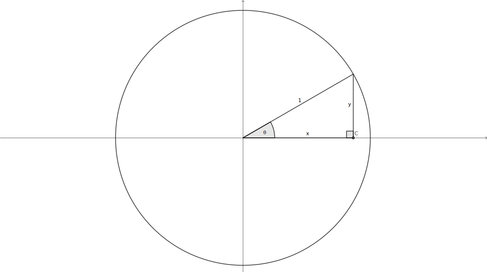
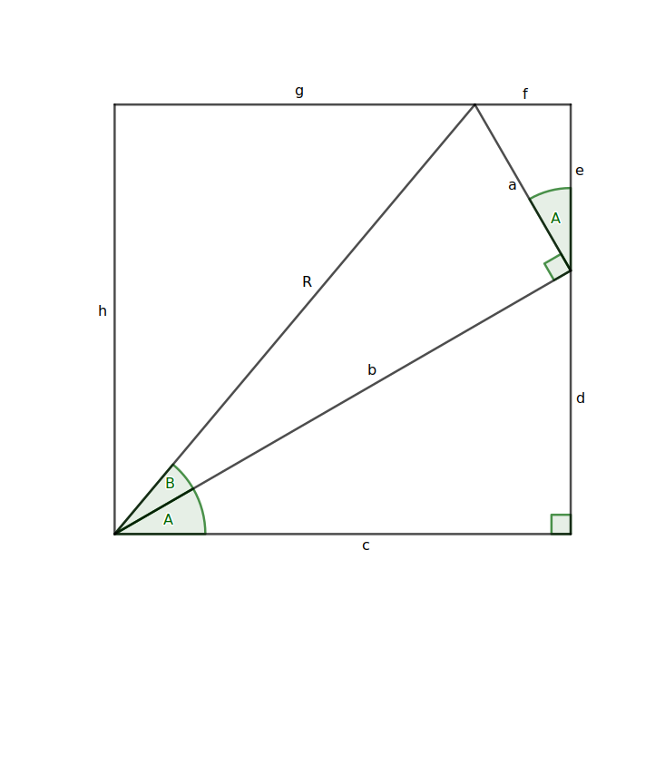

# Trigonometric identities with proofs

## Unit Circle



## Angle Addition Formulas




In the above diagram we have a rectangle formed from two right angled triangles on top of each other and the boundaries.

From the edges of the rectangle we can see that

``` math
\begin{align*}
h &= d+e\
c &= f+g
\end{align*}
```
