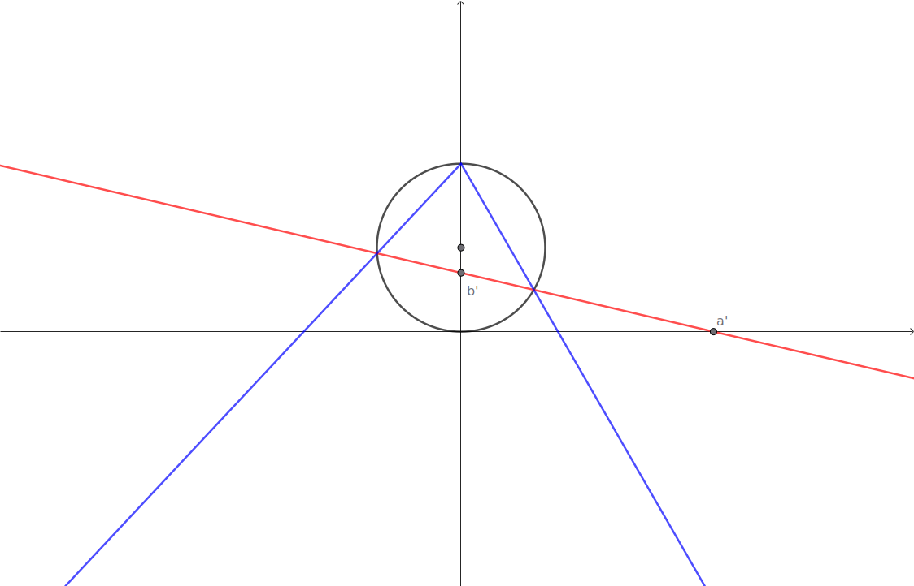

# Quadratic Nonogram

## Studying the circle and projection lines



### Equation of the line

The line goes through two points $(a',0)$ and $(0,b')$ so the equation of the line is

```math
\begin{align*}
\frac{x-a'}{y-0}&=\frac{0-a'}{b'-0} \\
\frac{x-a'}{y}&=-\frac{a'}{b'} \\
x-a'&=-y\frac{a'}{b'} \\
b'-\frac{b'}{a'}x&=y \\
\end{align*}
```

### Equation of the circle

The circle is a circle of radius $R$ is centered at the point $(0,R)$ and so the equation is

```math
x^2+(y-R)^2=R^2
```

### Intersection of the circle and our line

We can substitute the equation for our line $y=b'-\frac{b'}{a'}x$ into the eqution for the circle $x^2+(y-R)^2=R^2$ and solve for $x$

```math
\begin{align*}
R^2&=x^2+(y-R)^2\\
&=x^2+\left(b'-\frac{b'}{a'}x-R\right)^2\\
&=x^2+\left(b'-R-\frac{b'}{a'}x\right)^2\\
&=x^2+(b'-R)^2 -2(b'-R)\frac{b'}{a'}x + \left(\frac{b'}{a'}\right)^2x^2\\
0&=\left(1+\left(\frac{b'}{a'}\right)^2\right)x^2 -2(b'-R)\frac{b'}{a'}x+(b'-R)^2-R^2\\
&=\left(1+\left(\frac{b'}{a'}\right)^2\right)x^2 -2(b'-R)\frac{b'}{a'}x+b'^2 - 2b'R +R^2-R^2\\
&=\left(1+\left(\frac{b'}{a'}\right)^2\right)x^2 -2(b'-R)\frac{b'}{a'}x+b'^2 - 2b'R \\
&=a'^2\left(1+\left(\frac{b'}{a'}\right)^2\right)x^2 -2a'^2(b'-R)\frac{b'}{a'}x+a'^2b'^2 - 2a'^2b'R\\
&=\left(a'^2+a'^2b'^2\right)x^2 -2a'b'(b'-R)x+a'^2b'^2 - 2a'^2b'R\\
&=a'^2\left(1+b'^2\right)x^2 -2a'b'(b'-R)x+a'^2b'^2 - 2a'^2b'R\\
\end{align*}
```

That's probably as simple as it gets. We can now apply the quadratic formula to get the roots.

```math
x^* = \frac{2a'b'(b'-R) \pm \sqrt{(-2a'b'(b'-R))^2-4(a'^2\left(1+b'^2\right))(a'^2b'^2 - 2a'^2b'R)}}{2a'^2\left(1+b'^2\right)}
```

Because that is a big equation, lets simplify it in parts first.

```math
\begin{align*}
(-2a'b'(b'-R))^2 &= (-2a'b')^2(b'-R)^2\\
&=4a'^2b'^2(b'-R)^2\\
&=4a'^2b'^2(b'^2-2b'R+R^2)\\
&=4a'^2b'^4-8a'^2b'^3R+4a'^2b'^2R^2
\end{align*}
```

```math
\begin{align*}
4(a'^2(1+b'^2))(a'^2b'^2 - 2a'^2b'R) &=
4a'^2b'(a'^2(1+b'^2))(b' - 2R) \\
&= 4a'^4b'(1+b'^2)(b' - 2R) \\
&= 4a'^4b'(b' - 2R+b'^2(b' - 2R))\\
&= 4a'^4b'(b' - 2R+b'^3 - 2b'^2R)\\
&= 4a'^4b'^2 - 8a'^4b'R+4a'^4b'^4 - 8a'^4b'^3R
\end{align*}
```

Can then combine the two results for the inside of the square root

```math
\begin{align*}
&-2a'b'(b'-R))^2-4(a'^2\left(1+b'^2\right))(a'^2b'^2 - 2a'^2b'R \\
&= 4a'^2b'^4-8a'^2b'^3R+4a'^2b'^2R^2 - (4a'^4b'^2 - 8a'^4b'R+4a'^4b'^4 - 8a'^4b'^3R)\\
&= 4a'^2b'^4-8a'^2b'^3R+4a'^2b'^2R^2 - 4a'^4b'^2 + 8a'^4b'R-4a'^4b'^4 + 8a'^4b'^3R\\
&= 4a'^2(b'^4-2b'^3R+b'^2R^2 - a'^2b'^2 + 2a'^2b'R-a'^2b'^4 + 2a'^2b'^3R)\\
&= 4a'^2(b'^4- a'^2b'^2 -a'^2b'^4 -2b'^3R+b'^2R^2  + 2a'^2b'R + 2a'^2b'^3R)\\
&= 4a'^2(b'^2(b'^2- a'^2 -a'^2b'^2) + Rb'(-2b'^2+b'R  + 2a'^2 + 2a'^2b'^2))\\
&= 4a'^2b'(b'(b'^2- a'^2 -a'^2b'^2) + R(-2b'^2+b'R  + 2a'^2 + 2a'^2b'^2))\\
&= 4a'^2b'(b'(b'^2- a'^2 -a'^2b'^2) - 2R(b'^2  - a'^2 - a'^2b'^2)+b'R^2)\\
&= 4a'^2b'((b'-2R)(b'^2- a'^2 -a'^2b'^2)+b'R^2)\\
\end{align*}
```
