# Relay Computer Notes

## Useful Links

- [pull up/down resistors](https://en.wikipedia.org/wiki/Pull-up_resistor)

## Nand Gate

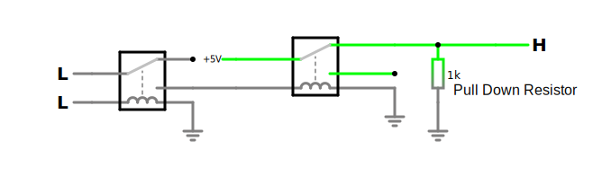

### Nand Gate Truth Table

| A   | B   | Q   |                                         |
| --- | --- | --- | --------------------------------------- |
| 0   | 0   | 1   | 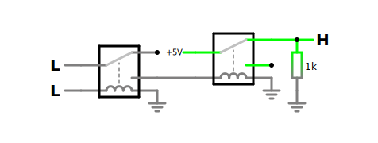 |
| 0   | 1   | 1   | 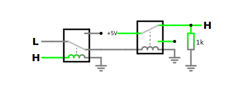 |
| 1   | 0   | 1   | 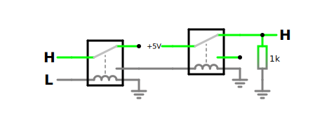 |
| 1   | 1   | 0   | 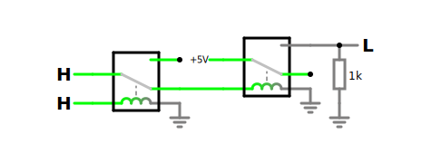 |

## And Gate

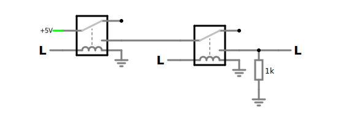

### And Gate Truth Table

| A   | B   | Q   |                                       |
| --- | --- | --- | ------------------------------------- |
| 0   | 0   | 0   | 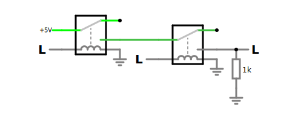 |
| 0   | 1   | 0   | 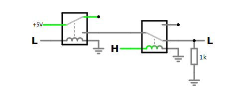 |
| 1   | 0   | 0   | 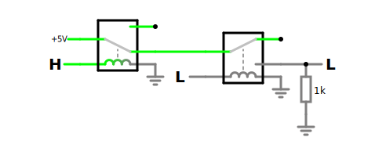 |
| 1   | 1   | 1   | 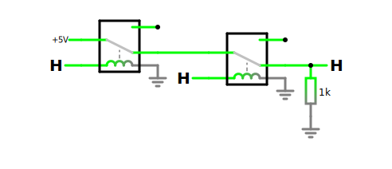 |

## Not Gate

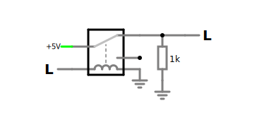

## Or Gate

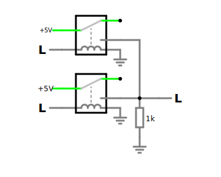

## Nor Gate

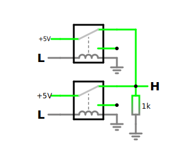
