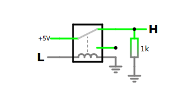
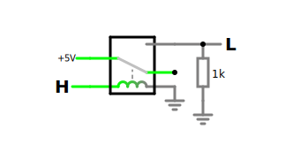
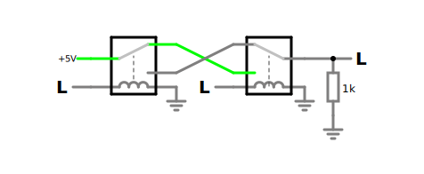
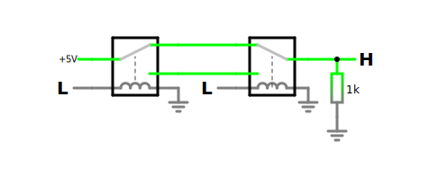

# Relay Computer Notes

## Useful Links

- [pull up/down resistors](https://en.wikipedia.org/wiki/Pull-up_resistor)
- [instruction cycle](https://en.wikipedia.org/wiki/Instruction_cycle)

## NAND Gate

### NAND Gate Truth Table

| A   | B   | Q   |                                         |
| --- | --- | --- | --------------------------------------- |
| 0   | 0   | 1   |  |
| 0   | 1   | 1   |  |
| 1   | 0   | 1   |  |
| 1   | 1   | 0   |  |

## AND Gate

### AND Gate Truth Table

| A   | B   | Q   |                                       |
| --- | --- | --- | ------------------------------------- |
| 0   | 0   | 0   |  |
| 0   | 1   | 0   |  |
| 1   | 0   | 0   |  |
| 1   | 1   | 1   |  |

## NOT Gate

### NOT Gate Truth Table

| A   | Q   |                                      |
| --- | --- | ------------------------------------ |
| 0   | 1   |  |
| 1   | 0   |  |

## OR Gate

## NOR Gate

## XOR Gate

## XNOR Gate

