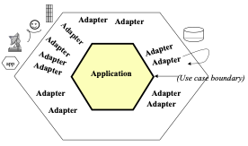
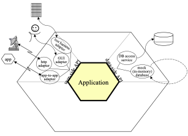
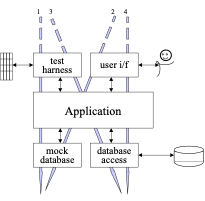
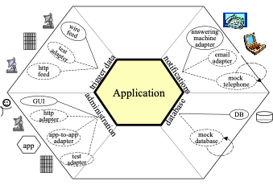

# Hexagonal Architecture

This is a markdown copy of the original paper by Alistair Cockburn which can be found [online here](https://alistair.cockburn.us/hexagonal-architecture). Please note, I am not the original author, I this is simply a copy in a slightly more modern format.

## The Hexagonal (Ports & Adapters) Architecture

_Create your application to work without either a UI or a database so you can run automated regression-tests against the application, work when the database becomes unavailable, and link applications together without any user involvement._

### The Pattern: Ports and Adapters (Object Structural)

> Alternative name: Hexagonal Architecture

#### Intent

Allow an application to equally be driven by users, programs, automated test or batch scripts, and to be developed and tested in isolation from its eventual run-time devices and databases.

As events arrive from the outside world at a port, a technology-specific adapter converts it into a usable procedure call or message and passes it to the application. The application is blissfully ignorant of the nature of the input device. When the application has something to send out, it sends it out through a port to an adapter, which creates the appropriate signals needed by the receiving technology (human or automated). The application has a semantically sound interaction with the adapters on all sides of it, without actually knowing the nature of the things on the other side of the adapters.



#### Motivation

One of the great bugaboos of software applications over the years has been infiltration of business logic into the user interface code. The problem this causes is threefold: First, the system can't neatly be tested with automated test suites because part of the logic needing to be tested is dependent on oft-changing visual details such as field size and button placement; For the exact same reason, it becomes impossible to shift from a human-driven use of the system to a batch-run system; For still the same reason, it becomes difficult or impossible to allow the program to be driven by another program when that becomes attractive.

The attempted solution, repeated in many organizations, is to create a new layer in the architecture, with the promise that this time, really and truly, no business logic will be put into the new layer. However, having no mechanism to detect when a violation of that promise occurs, the organization finds a few years later that the new layer is cluttered with business logic and the old problem has reappeared.

Imagine now that every piece of functionality the application offers were available through an API (application programmed interface) or function call. In this situation, the test or QA department can run automated test scripts against the application to detect when any new coding breaks a previously working function. The business experts can create automated test cases, before the GUI details are finalized, that tells the programmers when they have done their work correctly (and these tests become the ones run by the test department). The application can be deployed in headless mode, so only the API is available, and other programs can make use of its functionality -- this simplifies the overall design of complex application suites and also permits business-to-business service applications to use each other without human intervention over the web. Finally, the automated function regression tests detect any violation of the promise to keep business logic out of the presentation layer. The organization can detect, and then correct, the logic leak.

An interesting similar problem exists on what is normally considered "the other side" of the application, where the application logic gets tied to an external database or other service. When the database server goes down or undergoes significant rework or replacement, the programmers can't work because their work is tied to the presence of the database. This causes delay costs and often bad feelings between the people.

It is not obvious that the two problems are related, but there is a symmetry between them that shows up in the nature of the solution.

#### Nature of the Solution

Both the user-side and the server-side problems actually are caused by the same error in design and programming -- the entanglement between the business logic and the interaction with external entities. The asymmetry to exploit is not that between left and right sides of the application but between inside and outside of the application. The rule to obey is that code pertaining to the inside part should not leak into the outside part.

Removing any left-right or up-down asymmetry for a moment, we see that the application communicates over ports to external agencies. The word "port" is supposed to evoke thoughts of ports in an operating system, where any device that adheres to the protocols of a port can be plugged into it; and ports on electronics gadgets, where again, any device that fits the mechanical and electrical protocols can be plugged in. The protocol for a port is given by the purpose of the conversation between the two devices. The protocol takes the form of an application program interface (API).

For each external device there is an adapter that converts the API definition to the signals needed by that device and vice versa. A graphical user interface or GUI is an example of an adapter that maps the movements of a person to the API of the port. Other adapters that fit the same port are automated test harnesses such as FIT or Fitnesse, batch drivers, and any code needed for communication between applications across the enterprise or net.

On another side of the application, the application communicates with an external entity to get data. The protocol is typically a database protocol. From the application's perspective, if the database is moved from a SQL database to a flat file or any other kind of database, the conversation across the API should not change. Additional adapters for the same port thus include an SQL adapter, a flat file adapter, and most importantly, an adapter to a "mock" database, one that sits in memory and doesn't depend on the presence of the real database at all.

Many applications have only two ports: the user-side dialog and the database-side dialog. This gives them an asymmetric appearance, which makes it seem natural to build the application in a one-dimensional, three-, four-, or five-layer stacked architecture.

There are two problems with these drawings. First and worst, people tend not to take the "lines" in the layered drawing seriously. They let the application logic leak across the layer boundaries, causing the problems mentioned above. Secondly, there may be more than two ports to the application, so that the architecture does not fit into the one-dimensional layer drawing.

The hexagonal, or ports and adapters, architecture solves these problems by noting the symmetry in the situation: there is an application on the inside communicating over some number of ports with things on the outside. The items outside the application can be dealt with symmetrically.

The hexagon is intended to visually highlight

1. the inside-outside asymmetry and the similar nature of ports, to get away from the one-dimensional layered picture and all that evokes, and
2. the presence of a defined number of different ports - two, three, or four (four is most I have encountered to date).

The hexagon is not a hexagon because the number six is important, but rather to allow the people doing the drawing to have room to insert ports and adapters as they need, not being constrained by a one-dimensional layered drawing. The term hexagonal architecture comes from this visual effect.

The term "port and adapters" picks up the purposes of the parts of the drawing. A port identifies a purposeful conversation. There will typically be multiple adapters for any one port, for various technologies that may plug into that port. Typically, these might include a phone answering machine, a human voice, a touch-tone phone, a graphical human interface, a test harness, a batch driver, an http interface, a direct program-to-program interface, a mock (in-memory) database, a real database (perhaps different databases for development, test, and real use).

In the Application Notes, the left-right asymmetry will be brought up again. However, the primary purpose of this pattern is to focus on the inside-outside asymmetry, pretending briefly that all external items are identical from the perspective of the application.

#### Structure



Figure 2 shows an application having two active ports and several adapters for each port. The two ports are the application-controlling side and the data-retrieval side. This drawing shows that the application can be equally driven by an automated, system-level regression test suite, by a human user, by a remote http application, or by another local application. On the data side, the application can be configured to run decoupled from external databases using an in-memory oracle, or mock, database replacement; or it can run against the test- or run-time database. The functional specification of the application, perhaps in use cases, is made against the inner hexagon's interface and not against any one of the external technologies that might be used.



Figure 3 shows the same application mapped to a three-layer architectural drawing. To simplify the drawing only two adapters are shown for each port. This drawing is intended to show how multiple adapters fit in the top and bottom layers, and the sequence in which the various adapters are used during system development. The numbered arrows show the order in which a team might develop and use the application:

1. With a FIT test harness driving the application and using the mock (in-memory) database substituting for the real database;
2. Adding a GUI to the application, still running off the mock database;
3. In integration testing, with automated test scripts (e.g., from Cruise Control) driving the application against a real database containing test data;
4. In real use, with a person using the application to access a live database.

#### Sample Code

The simplest application that demonstrates the ports & adapters fortunately comes with the FIT documentation. It is a simple discount computing application:

```pseudocode
discount(amount) = amount * rate(amount);
```

In our adaptation, the amount will come from the user and the rate will come from a database, so there will be two ports. We implement them in stages:

- With tests but with a constant rate instead of a mock database,
- then with the GUI,
- then with a mock database that can be swapped out for a real database.

Thanks to Gyan Sharma at IHC for providing the code for this example.

##### Stage 1: FIT + App + constant-as-mock-database

First we create the test cases as an HTML table (see the FIT documentation for this)

| TestDiscounter |            |
| -------------- | ---------- |
| amount         | discount() |
| 100            | 5          |
| 200            | 10         |

Note that the column names will become class and function names in our program. FIT contains ways to get rid of this "programmerese", but for this article it is easier just to leave them in.

Knowing what the test data will be, we create the user-side adapter, the ColumnFixture that comes with FIT as shipped:

``` java
import fit.ColumnFixture;

public class TestDiscounter extends ColumnFixture
{
   private Discounter app = new Discounter();
   public double amount;
   public double discount() {
      return app.discount(amount);
   }
}
```

That's actually all there is to the adapter. So far, the tests run from the command line (see the FIT book for the path you'll need). We used this one:

``` bash
set FIT_HOME=/FIT/FitLibraryForFit15Feb2005
java  
      -cp %FIT_HOME%/lib/javaFit1.1b.jar;%FIT_HOME%/dist/fitLibraryForFit.jar; src;bin  
      fit.FileRunner   test/Discounter.html   TestDiscount_Output.htmls
```

FIT produces an output file with colors showing us what passed (or failed, in case we made a typo somewhere along the way).

At this point the code is ready to check in, hook into Cruise Control or your automated build machine, and include in the build-and-test suite.

##### Stage 2: UI + App + constant-as-mock-database

I'm going to let you create your own UI and have it drive the Discounter application, since the code is a bit long to include here. Some of the key lines in the code are these:

``` java
...
Discounter app = new Discounter();

public void actionPerformed(ActionEvent event) {
   ...
   String amountStr = text1.getText();
   double amount = Double.parseDouble(amountStr);
   discount = app.discount(amount)s;
   text3.setText( "" + discount );
...
```

At this point the application can be both demoed and regression tested. The user-side adapters are both running.

##### Stage 3: (FIT or UI) + App + mock database

To create a replaceable adapter for the database side, we create an interface to a repository, a RepositoryFactory that will produce either the mock database or the real service object, and the in-memory mock for the database.

``` java
public interface RateRepository {
   double getRate(double amount);
}
```

``` java
public class RepositoryFactory {
   public RepositoryFactory() { super(); }
   public static RateRepository getMockRateRepository() {
      return new MockRateRepository();
   }
}
```

``` java
public class MockRateRepository implements RateRepository {
   public double getRate(double amount) {
      if(amount <= 100) return 0.01;
      if(amount <= 1000) return 0.02;
      return 0.05;
   }
}
```

To hook this adapter into the Discounter application, we need to update the application itself to accept a repository adapter to use, and the have the (FIT or UI) user-side adapter pass the repository to use (real or mock) into the constructor of the application itself. Here is the updated application and a FIT adapter that passes in a mock repository (the FIT adapter code to choose whether to pass in the mock or real repository's adapter is longer without adding much new information, so I omit that version here).

``` java
import repository.RepositoryFactory;
import repository.RateRepository;

public class Discounter {
   private RateRepository rateRepository;
   public Discounter(RateRepository r) {
      super();
      rateRepository = r;
   }
   public double discount(double amount) {
      double rate = rateRepository.getRate( amount );
      return amount * rate;
   }
}
```

``` java
import app.Discounter;
import fit.ColumnFixture;

public class TestDiscounter extends ColumnFixture {
   private Discounter app =
      new Discounter(RepositoryFactory.getMockRateRepository());
   public double amount;

   public double discount() {
      return app.discount( amount );
   }
}
```

That concludes implementation  of the simplest version of the hexagonal architecture.

#### Application Notes

##### The Left-Right Asymmetry

The ports and adapters pattern is deliberately written pretending that all ports are fundamentally similar. That pretense is useful at the architectural level. In implementation, ports and adapters show up in two flavors, which I'll call primary and secondary, for soon-to-be-obvious reasons. They could be also called driving adapters and driven adapters.

The alert reader will have noticed that in all the examples given, FIT fixtures are used on the left-side ports and mocks on the right. In the three-layer architecture, FIT sits in the top layer and the mock sits in the bottom layer.

This is related to the idea from use cases of "primary actors" and "secondary actors". A primary actor is an actor that drives the application (takes it out of quiescent state to perform one of its advertised functions). A secondary actor is one that the application drives, either to get answers from or to merely notify. The distinction between primary and secondary lies in who triggers or is in charge of the conversation.

The natural test adapter to substitute for a primary actor is FIT, since that framework is designed to read a script and drive the application. The natural test adapter to substitute for a secondary actor such as a database is a mock, since that is designed to answer queries or record events from the application.

These observations lead us to follow the system's use case context diagram and draw the primary ports and primary adapters on the left side (or top) of the hexagon, and the secondary ports and secondary adapters on the right (or bottom) side of the hexagon.

The relationship between primary and secondary ports/adapters and their respective implementation in FIT and mocks is useful to keep in mind, but it should be used as a consequence of using the ports and adapters architecture, not to short-circuit it. The ultimate benefit of a ports and adapters implementation is the ability to run the application in a fully isolated mode.

##### Use Cases And The Application Boundary

It is useful to use the hexagonal architecture pattern to reinforce the preferred way of writing use cases.

A common mistake is to write use cases to contain intimate knowledge of the technology sitting outside each port. These use cases have earned a justifiably bad name in the industry for being long, hard-to-read, boring, brittle, and expensive to maintain.

Understanding the ports and adapters architecture, we can see that the use cases should generally be written at the application boundary (the inner hexagon), to specify the functions and events supported by the application, regardless of external technology. These use cases are shorter, easier to read, less expensive to maintain, and more stable over time.

##### How Many Ports?

What exactly a port is and isn't is largely a matter of taste. At the one extreme, every use case could be given its own port, producing hundreds of ports for many applications. Alternatively, one could imagine merging all primary ports and all secondary ports so there are only two ports, a left side and a right side.

Neither extreme appears optimal.

The weather system described in the Known Uses has four natural ports: the weather feed, the administrator, the notified subscribers, the subscriber database. A coffee machine controller has four natural ports: the user, the database containing the recipes and prices, the dispensers, and the coin box. A hospital medication system might have three: one for the nurse, one for the prescription database, and one for the computer-controller medication dispensers.

It doesn't appear that there is any particular damage in choosing the "wrong" number of ports, so that remains a matter of intuition. My selection tends to favor a small number, two, three or four ports, as described above and in the Known Uses.

#### Known Uses



Figure 4 shows an application with four ports and several adapters at each port. This was derived from an application that listened for alerts from the national weather service about earthquakes, tornadoes, fires and floods, and notified people on their telephones or telephone answering machines. At the time we discussed this system, the system's interfaces were identified and discussed by technology, linked to purpose. There was an interface for trigger-data arriving over a wire feed, one for notification data to be sent to answering machines, an administrative interface implemented in a GUI, and a database interface to get their subscriber data.

The people were struggling because they needed to add an http interface from the weather service, an email interface to their subscribers, and they had to find a way to bundle and unbundle their growing application suite for different customer purchasing preferences. They feared they were staring at a maintenance and testing nightmare as they had to implement, test and maintain separate versions for all combinations and permutations.

Their shift in design was to architect the system's interfaces by purpose rather than by technology, and to have the technologies be substitutable (on all sides) by adapters. They immediately picked up the ability to include the http feed and the email notification (the new adapters are shown in the drawing with dashed lines). By making each application executable in headless mode through APIs, they could add an app-to-add adapter and unbundle the application suite, connecting the sub-applications on demand. Finally, by making each application executable completely in isolation, with test and mock adapters in place, they gained the ability to regression test their applications with stand-alone automated test scripts.

##### Mac, Windows, Google, Flickr, Web 2.0

In the early 1990s, MacIntosh applications such as word processor applications were required to have API-drivable interfaces, so that applications and user-written scripts could access all the functions of the applications. Windows desktop applications have evolved the same ability (I don't have the historical knowledge to say which came first, nor is that relevant to the point).

The current (2005) trend in web applications is to publish an API and let other web applications access those APIs directly. Thus, it is possible to publish local crime data over a Google map, or create web applications that include Flickr's photo archiving and annotating abilities.

All of these examples are about making the primary ports' APIs visible. We see no information here about the secondary ports.

##### Stored Outputs

This example written by Willem Bogaerts on the C2 wiki:

"I encountered something similar, but mainly because my application layer had a strong tendency to become a telephone switchboard that managed things it should not do. My application generated output, showed it to the user and then had some possibility to store it as well. My main problem was that you did not need to store it always. So my application generated output, had to buffer it and present it to the user. Then, when the user decided that he wanted to store the output, the application retrieved the buffer and stored it for real.

I did not like this at all. Then I came up with a solution: Have a presentation control with storage facilities. Now the application no longer channels the output in different directions, but it simply outputs it to the presentation control. It's the presentation control that buffers the answer and gives the user the possibility to store it.

The traditional layered architecture stresses "UI" and "storage" to be different. The Ports and Adapters Architecture can reduce output to being simply "output" again. "

##### Anonymous example from the C2-wiki

"In one project I worked on, we used the SystemMetaphor of a component stereo system. Each component has defined interfaces, each of which has a specific purpose. We can then connect components together in almost unlimited ways using simple cables and adapters."

##### Distributed, Large-Team Development

This one is still in trial use and so does not properly count as a use of the pattern. However, it is interesting to consider.

Teams in different locations all build to the Hexagonal architecture, using FIT and mocks so the applications or components can be tested in standalone mode. The CruiseControl build runs every half hour and runs all the applications using the FIT+mock combination. As application subsystem and databases get completed, the mocks are replaced with test databases.

##### Separating Development of UI and Application Logic

This one is still in early trial use and so does not count as a use of the pattern. However, it is interesting to consider.

The UI design is unstable, as they haven't decided on a driving technology or a metaphor yet. The back-end services architecture hasn't been decided, and in fact will probably change several times over the next six months. Nonetheless, the project has officially started and time is ticking by.

The application team creates FIT tests and mocks to isolate their application, and creates testable, demonstrable functionality to show their users. When the UI and back-end services decisions finally get met, it "should be straightforward" to add those elements the application.  Stay tuned to learn how this works out (or try it yourself and write me to let me know).

#### Related Patterns

##### Adapter

The Design Patterns book contains a description of the generic Adapter pattern: "Convert the interface of a class into another interface clients expect." The ports-and-adapters pattern is a particular use of the Adapter pattern.

#### Model-View-Controller

The MVC pattern was implemented as early as 1974 in the Smalltalk project. It has been given, over the early, many variations, such as Model-Interactor and Model-View-Presenter. Each of these implements the idea of ports-and-adapters on the primary ports, not the secondary ports.

##### Mock Objects and Loopback

"A mock object is a "double agent" used to test the behaviour of other objects. First, a mock object acts as a faux implementation of an interface or class that mimics the external behaviour of a true implementation. Second, a mock object observes how other objects interact with its methods and compares actual behaviour with preset expectations. When a discrepancy occurs, a mock object can interrupt the test and report the anomaly. If the discrepancy cannot be noted during the test, a verification method called by the tester ensures that all expectations have been met or failures reported." -- From <http://MockObjects.com>

Fully miplemented according to the mock-object agenda, mock objects are used throughout an application, not just at the external interface The primary thrust of the mock object movement is conformance to specified protocol at the individual class and object level. I borrow their word "mock" as the best short description of an in-memory substitute for an external secondary actor.

The Loopback pattern is an explicit pattern for creating an internal replacement for an external device.

##### Pedestals

In "Patterns for Generating a Layered Architecture", Barry Rubel describes a pattern about creating an axis of symmetry in control software that is very similar to ports and adapters. The Pedestal pattern calls for implementing an object representing each hardware device within the system, and linking those objects together in a control layer. The Pedestal pattern can be used to describe either side of the hexagonal architecture, but does not yet stress the similarity across adapters. Also, being written for a mechanical control environment, it is not so easy to see how to apply the pattern to IT applications.

##### Checks

Ward Cunningham's pattern language for detecting and handling user input errors, is good for error handling across the inner hexagon boundaries.

##### Dependency Inversion (Dependency Injection) and SPRING

Bob Martin's Dependency Inversion Principle (also called Dependency Injection by Martin Fowler) states that "High-level modules should not depend on low-level modules. Both should depend on abstractions.  Abstractions should not depend on details. Details should depend on abstractions." The Dependency Injection pattern by Martin Fowler gives some implementations. These show how to create swappable secondary actor adapters. The code can be typed in directly, as done in the sample code in the article, or using configuration files and having the SPRING framework generate the equivalent code.

#### Acknowledgements

Thanks to Gyan Sharma at Intermountain Health Care for providing the sample code used here. Thanks to Rebecca Wirfs-Brock for her book Object Design, which when read together with the Adapter pattern from the Design Patterns book, helped me to understand what the hexagon was about. Thanks also to the people on Ward's wiki, who provided comments about this pattern over the years (e.g., particularly Kevin Rutherfold's <http://silkandspinach.net/blog/2004/07/hexagonal_soup.html>).

#### References and Related Reading

FIT, A Framework for Integrating Testing: Cunningham, W., online at <http://fit.c2.com>, and Mugridge, R. and Cunningham, W., Fit for Developing Software, Prentice-Hall PTR, 2005.

The Adapter pattern: in Gamma, E., Helm, R., Johnson, R., Vlissides, J.,  Design Patterns, Addison-Wesley, 1995, pp. 139-150.

The Pedestal pattern: in Rubel, B., "Patterns for Generating a Layered Architecture", in Coplien, J., Schmidt, D., PatternLanguages of Program Design, Addison-Wesley, 1995, pp. 119-150.

The Checks pattern: by Cunningham, W., online at <http://c2.com/ppr/checks.html>

The Dependency Inversion Principle: Martin, R., in Agile Software Development Principles Patterns and Practices, Prentice Hall, 2003, Chapter 11: "The Dependency-Inversion Principle", and online at <http://www.objectmentor.com/resources/articles/dip.pdf>

 The Dependency Injection pattern: Fowler, M., online at <http://www.martinfowler.com/articles/injection.html>

The Mock Object pattern: Freeman, S. online at <http://MockObjects.com>

The Loopback pattern: Cockburn, A., online at <http://c2.com/cgi/wiki?LoopBack>

Use cases: Cockburn, A., Writing Effective Use Cases, Addison-Wesley, 2001, and Cockburn, A., "Structuring Use Cases with Goals", online at <http://alistair.cockburn.us/crystal/articles/sucwg/structuringucswithgoals.htm>
